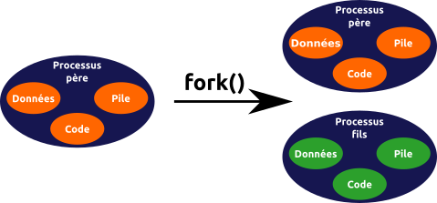
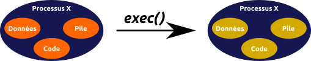

# API POSIX

Auteur : Corentin GUILLEVIC.

Très attiré par le développement système, j'ai commencé à écrire cette documentation pendant mes études afin d'archiver mes connaissances et les transmettre. Le présent document vise à être une énumération explicative des fonctions POSIX. Les explications représentent ce que j'ai compris de ces fonctions. Il vise aussi à fournir des morceaux de codes prêts à l'usage (avec conditions pour vérification) afin d'accélérer les développements.

Ce document est à ce jour en cours de rédaction. Il sera progressivement complété par de nouvelles fonctions, de nouveaux codes et des rectifications. À ce sujet, l'erreur étant humaine, n'hésitez pas à me faire part d'oublis ou d'erreurs.

## `fork()` 

### Présentation

**Prototype** :

```c
pid_t fork(void) ;
```

**Rôle** : Créé un nouveau processus fils à partir du processus actuel.

* La fonction `fork()` consiste à cloner le processus courant (c'est-à-dire son code, ses données, sa pile et un certain nombre de propriétés) puis de faire du clone son fils. Ce nouveau processus fils est donc une copie (presque) conforme de son processus père.
* À la fin de la fonction, les deux processus s'exécutent indépendamment de l'autre. Comme le père et le fils possèdent leurs propres segments de données et de pile, les modifications de variables sont isolés au processus concerné.

<center></center>

**Retour** : 

* La particularité de `fork()` est la différence du retour pour le processus fils et le processus père :

	* Chez le fils, la valeur retournée par `fork()` est égale à `0`.
	* Chez le père la valeur retournée est le PID du fils (> `0`).

	Cette différence de retour permet de dissocier le déroulement de l'exécution du programme entre le père et le fils.
* Si un échec dans `fork()` a lieu (mémoire insuffisante, trop de processus...) , il n'y aura pas de création de processus fils et la valeur `-1` sera retournée.

**Librairie(s)** : **unistd.h**. Importer la librairie **sys/types.h** pour utiliser le type `pid_t`.

### Héritage de propriétés

Lors de la création du processus fils, celui-ci hérite d'un certain nombre de propriétés de son père :

* Les fonctions à exécuter à la terminaison du programme (voir `atexit()`)
* L'UID et le GID, réels et effectifs
* Les variables d'environnement
* Le groupe de processus
* Les gestionnaires de signaux (*handler*, voir `sigaction()`)
* Le masque des signaux en vigueur (voir `sigprocmask()`)
* Les descripteurs de fichiers (voir `open()`)
* Lors de l'exécution de `fork()`, la table des descripteurs du processus père est copiée chez le fils. Du coup, tous les fichiers, sockets, tubes... ouverts par le père le sont également chez le fils. Cette copie ne provoque cependant aucune création d'entrées dans la table (globale) des fichiers ouverts : les entrées déjà allouées pour le processus père sont réutilisées par le fils. Ainsi, les drapeaux et le curseur de chaque fichier ouvert seront partagés entre le père et le fils. Enfin, une entrée de la table des fichiers ouverts est supprimée que lorsqu'il n'y a plus aucun descripteur pointant dessus ; fermer un descripteur chez le processus fils n'aura donc aucun impact chez le père (et vice-versa).

	> <font color="#d9534f">**Important**</font> : le comportement du descripteur d'entrée `stdin` est différent. Lorsque le *shell* créé un processus, il lui transmet le descripteur `stdin` (c'est pour cette raison que le *shell* est inutilisable pendant ce temps-là). Celui-ci peut être transmis sans incidencevia `fork()`, mais si le processus principal (celui qui a été créé par le *shell*) termine avant ses descendants, alors le descripteur `stdin` reviendra au *shell* (on pourra de nouveau y écrire des commandes). Les descendants, eux, ne pourront plus faire appel à des fonctions telles que `scanf()`. **Donc si on manipule le descripteur `stdin` entre processus affiliés, toujours veiller à ce que le processus ancêtre commun (celui créé par le *shell*) termine en dernier !**

### Exemple

```c
pid_t pid ;
pid = fork() ; /* Création d'un processus fils et récupération de la valeur de retour */
if (pid) {
	/* Code exécuté par le père */
} else if (pid == 0) {
	/* Code exécuté par le fils */
} else { /* En cas d'erreur */
	perror("fork") ;
	exit(EXIT_FAILURE) ;
}
```

## Famille `exec()` 

### Présentation

**Prototype** :
```c
int execve(const char *filename, char *const argv[], char *const envp[]);
int execl(const char *path, const char *arg, ...);
int execlp(const char *file, const char *arg, ...);
int execle(const char *path, const char *arg, ..., char *const envp[]);
int execv(const char *path, char *const argv[]);
int execvp(const char *file, char *const argv[]);
int execvpe(const char *file, char *const argv[], char *const envp[]);
```

**Arguments** :

| Argument | Utilité |
|----------|---------|
| `file`/`filename`/`path` | Nom de/chemin vers l'exécutable à exécuter |
| `argv[]`/`arg` | Tableau d'arguments / argument N |
| `envp[]` | Tableau de variables d'environnement |

**Rôle** : Remplace le programme que le processus représente par un autre programme.

* Les fonctions de la famille *exec* remplacent l'image du processus actuel (c'est-à-dire son code, ses données, tas, pile...) par une nouvelle image récupérée depuis un fichier exécutable. L'exécution de l'ancienne image est du coup annulée (le code qui suivait l'appel ne sera jamais exécuté).

<center></center>

* Les arguments `arg`/`argv[]` sont le seul moyen pour l'ancien programme de communiquer avec le nouveau.
* Les fonctions de la famille *exec* ne sont que des interfaces qui se servent de `execve()` pour offrir une utilisation différente (listes, chemin...). `execve()` est donc la "vraie" fonction *exec*.
* Le tableau ou la liste des arguments doit obligatoirement se terminer par `NULL`.

> <font color="#5bc0de">**Note**</font> : pour comprendre pourquoi on renseigne deux fois le nom du programme que l'on souhaite lancer dans les paramètres des fonctions exec, consulter la remarque II) en annexe.

**Retour** :

* Il n'y a aucun retour en cas de succès (puisque les fonctions de la famille *exec* ne rendent pas la main à l'ancien programme), mais s'il y a échec le code `-1` sera retourné et l'ancien programme continuera son exécution.

**Librairie(s)** : **unistd.h**.

### Suffixes et héritage de propriétés

Les fonctions de la famille *exec* possèdent toutes le préfixe `exec` suivi de différents suffixes indiquant la manière de les utiliser et les configurations possibles :

* `e` (*environment*) : la fonction inclut un paramètre supplémentaire, `envp[]`, qui récupère un tableau de pointeurs (obligatoirement terminé par `NULL`) contenants l'ensemble des variables d'environnement à transmettre. Toute variable d'environnement absente du tableau n'existera plus dans le nouveau programme (y compris les variables pré-définies telles que `$PATH`, `$HOME`...).

	Si la fonction exec ne contient pas ce suffixe, l'ensemble des variables d'environnement de l'ancien programme seront transmises en l'état au nouveau.
* `l` (*list*) : la fonction s'utilise sous forme d'une liste, c'est-à-dire qu'il est possible d'avoir autant d'arguments que souhaité pour exprimer les paramètres à transmettre au prochain programme.
* `p` (*path*) : la fonction s'aide de la variable d'environnement `$PATH` pour retrouver l'emplacement d'un programme si on omet partiellement ou totalement les répertoires (c'est-à-dire qu'il ne contient pas de `/`). Ainsi, si on ne cite que `ls`, la fonction s'aidera du `$PATH` pour déterminer que le programme `ls` se trouve dans **/bin/ls**, pour ensuite l'exécuter. Si la fonction *exec* ne contient pas ce suffixe, chaque appel à un programme nécessitera de préciser en plus son chemin (absolu ou relatif).
* `v` (*vector*) : la fonction s'utilise sous forme d'un tableau, c'est-à-dire que les arguments à transmettre au prochain programme seront d'abord placés dans un tableau, dont l'adresse figure en argument de la fonction.

Parmi toutes les propriétés qu'un processus peut avoir, une partie sera conservée si l'appel à une fonction exec réussit :

* Les UID/GID réels et effectifs

	> <font color="#d9534f">**Important**</font> : les UID/GID réels et effectifs sont habituellement conservés. Mais si le fichier à exécuter dispose des droits *SetUID* et/ou *SetGID*, alors l'UID et/ou le GID effectif du processus deviendra celui du fichier.

### Exemple

**Exemple 1**

```c
/* Tableau d'arguments destiné au programme à exécuter (ici "ls"). Noter que NULL est ajouté conventionnellement mais n'est pas nécessaire, du fait qu'un tableau de chaînes de caractères fini toujours implicitement par NULL */
char *args[] = {"ls", "-l", "/bin", NULL} ;
/* Lance l'exécution du programme "ls" (le chemin étant repéré par la variable globale $PATH) avec les arguments fourni par un vecteur (tableau args[]) */
execvp("ls", args) ;
/* A partir d'ici, tout le code suivant ne sera pas exécuté, sauf si l'appel au programme a échoué d'une quelconque manière */
perror("exec") ;
```

**Exemple 2**

```c
/* Lance l'exécution du programme "ls" (le chemin étant spécifié) avec les arguments fourni sous forme d'une liste (qui doit s'achever par NULL) */
execl("/bin/ls", "ls", "-l", "/etc", NULL) ;
perror("exec") ;
```

**Exemple 3**

```c
char *args[] = {"ls", "-l", "/usr", NULL} ;
/* Insère dans un tableau une définition des variables d'environnement $PATH et $MY_VARIABLE, destinées au programme à exécuter */
char *envp[] = {"PATH=/home/corentin/", "MY_VARIABLE=23" , NULL} ;
/* Lance l'exécution du programme "ls", qui aura seulement comme variables d'environnement celles définies dans le tableau (qui doit s'achever par NULL) */
execve("/bin/ls", args, envp) ;
perror("exec") ;
```

## `getuid()` et `geteuid()` 

### Présentation

**Prototype** :
```c
uid_t getuid(void) ;
uid_t geteuid(void) ;
```

**Rôle** : Obtenir le numéro d'identification de l'utilisateur (UID) réel/effectif du processus en cours.

* L'utilisateur réel est celui qui a lancé le processus tandis que l'utilisateur effectif est la plupart du temps le même que l'utilisateur réel, sauf en cas d'utilisation du droit *SetUID* sur l'exécutable. L'utilisateur effectif sera alors le propriétaire de l'exécutable qui détient le droit *SetUID*.

	> <font color="#5bc0de">**Note**</font> : voir en annexe les droits spéciaux UNIX pour plus de détails.

**Retour** :

* Renvoient un entier positif.
* Ces fonctions n'échouent jamais.

**Librairie(s)** : **unistd.h**. Importer également la librairie sys/types.h pour utiliser le type `uid_t`.

### Exemple

```c
uid_t uid, euid ;
/* Récupération de l'UID réel */
uid = getuid() ;
/* Récupération de l'UID effectif */
euid = geteuid() ;
printf("UID réel : %d, UID effectif : %d\n", uid, euid) ;
```

## `getpid()` et `getppid()` 

### Présentation

**Prototype** :
```c
pid_t getpid(void) ;
pid_t getppid(void) ;
```

**Rôle** : Obtenir le numéro d'identification du processus (PID) en cours/père du processus courant.

* La fonction `getppid()` est le seul moyen simple pour qu'un processus fils connaisse l'identité de son père. Un processus père, pour connaitre ses fils, devra conserver les PID renvoyés par la fonction `fork()`.

**Retour** :

* Renvoient un numéro > 0.
* Ces fonctions n'échouent jamais.

**Librairie(s)** : **unistd.h**. Importer également la librairie sys/types.h pour utiliser le type `pid_t`.

### Exemple

```c
pid_t pid, ppid ;
/* Récupération du PID du processus courant */
pid = getpid() ;
/* Récupération du PID du processus père */
ppid = getppid() ;
printf("PID processus : %d, PID processus père : %d\n", pid, ppid) ;
```

## `getgid()` et `getegid()` 

### Présentation

**Prototype** :
```c
gid_t getgid(void) ;
gid_t getegid(void) ;
```

**Rôle** : Renvoi le numéro d'identification du groupe (GID) réel/effectif du processus en cours.

* Le groupe réel est celui de l'utilisateur (réel) qui a lancé le processus. Le groupe effectif est la plupart du temps le même que celui de l'utilisateur réel, sauf en cas d'utilisation du droit *SetGID* sur l'exécutable. Le groupe effectif sera alors celui du propriétaire de l'exécutable qui détient le droit *SetGID*.

	> <font color="#5bc0de">**Note**</font> : voir en annexe les droits spéciaux UNIX pour plus de détails.

**Retour** :

* Renvoient un entier positif.
* Ces fonctions n'échouent jamais.

**Librairie(s)** : **unistd.h**. Importer également la librairie sys/types.h pour utiliser le type `gid_t`.

### Exemple

```c
gid_t gid, egid ;
/* Récupération du GID réel */
gid = getgid() ;
/* Récupération du GID effectif */
egid = getegid() ;
printf("GID réel : %d, GID effectif : %d\n", gid, egid) ;
```

## `stat()` 

### Présentation

**Prototype** :
```c
int stat(const char *path, struct stat *buf) ;
```

**Arguments** :

| Argument | Utilité |
|----------|---------|
| `path` | Chemin d'accès vers un fichier |
| `buf` | Structure où seront stockées les méta-données |

**Rôle** : Collecte un ensemble de caractéristiques sur un fichier (représenté par son chemin) et le stocke dans une structure de type stat.

* L'objectif de la fonction `stat()` est de récupérer les métas-données (droits, taille, type...) du fichier pointé par l'argument `path`. Comme tout est fichier sous Linux, cela signifie que cette fonction marche également sur les répertoires, liens symboliques...
* Les permissions des fichiers n'ont aucun impact sur le fonctionnement de `stat()` puisque celui-ci se contente uniquement de consulter leurs métas-données. 
* Si l'argument `path` pointe vers un lien symbolique, les données collectées seront celles du fichier pointé par le lien symbolique. Pour obtenir les informations d'un lien symbolique, consulter `lstat()`.
* Existe sous la forme d'une commande *shell*, nommée simplement `stat`.

**Retour** :

* Si la collecte s'est bien déroulée, retourne `0`, et rempli la structure `buf`. Sinon renvoi `-1`.

	> <font color="#5bc0de">**Note**</font> : voir en annexe la structure `stat` pour en connaitre les détails.

**Librairie(s)** : **unistd.h**. Importer également la librairie **sys/stat.h** pour définir la structure de type `stat`, ainsi que la librairie **sys/types.h** pour utiliser les types contenus dans la structure et inclure quelques constantes et macros.

### Macros et masques associés

Le champ `st_mode` de la structure `stat` contient à la fois les droits d'accès et le type d'un fichier. Ces données sont représentées par des drapeaux, exploitables grâce à différents macros et masques.

*Masques* : les masques (de la librairie **sys/stat.h**) s'utilisent à l'aide de OU et de ET binaires pour isoler une information des drapeaux :

* (**Non POSIX**) Les masques pour déterminer le type de fichier :
	* `S_IFREG` : Fichier régulier
	* `S_IFDIR` : Répertoire
	* `S_FIFO` : Tube (*pipe*)
	* `S_IFBLK` : Périphérique "bloc"
	* `S_IFCHR` : Périphérique "caractère"
	* `S_IFLNK` : Lien symbolique
	* `S_IFDOOR` : Socket
* Les masques pour déterminer les droits d'accès du fichier (voir les constantes de `chmod()`).

*Macros* : Les macros permettent de tester simplement quel est le type d'un fichier (il n'y a pas de macros pour les droits). Chaque macro retourne `1` si c'est :

* `S_ISREG(m)` : un fichier régulier
* `S_ISDIR(m)` : un répertoire
* `S_ISFIFO(m)` : un tube
* `S_ISBLK(m)` : un périphérique "bloc"
* `S_ISCHR(m)` : un périphérique "caractère"
* `S_ISLNK(m)` : un lien symbolique
* `S_ISSOCK(m)` : un socket

Le paramètre `m` correspond à l'entier obtenu au champs `st_mode`.

> <font color="#5bc0de">**Note**</font> : la macro `S_ISLNK()` ne fonctionne que si les données ont été collectées avec `lstat()` et que le fichier soit un lien symbolique.

### Exemple

```c
/* Structure de stockage de l'état d'un fichier */
struct stat sb ;
/* Récupération des caractéristiques du fichier */
if (stat("my_file", &sb) == -1) {
	perror("stat") ;
	exit(EXIT_FAILURE) ;
}
/* Affichage de quelques éléments de la structure fraîchement remplie */
printf("Inode : %d, Proriétaire : %d\n", sb.st_ino, sb.st_uid) ;
/* Analyse du type du fichier (ici un fichier régulier) à l'aide d'une macro */
if (S_ISREG(sb.st_mode)) {
	printf("my_file est un fichier régulier.\n") ;
}
/* Idem, mais à l'aide d'un masque */
if (sb.st_mode&S_IFREG) {
	printf("my_file est un fichier régulier.\n") ;
}
```

## `fstat()` 

### Présentation

**Prototype** :
```c
int fstat(int fd, struct stat *buf) ;
```

**Arguments** :

| Argument | Utilité |
|----------|---------|
| `fd` | Descripteur d'un fichier |
| `buf` | Structure où seront stockées les méta-données |

**Rôle** : Collecte un ensemble de caractéristiques sur un fichier (représenté par son descripteur de fichier) et le stocke dans une structure de type `stat`.

* Cette fonction est identique à `stat()`, à l'exception que l'on fournit non pas un chemin (`path`) mais un descripteur de fichier. Le mode d'accès du descripteur (lecture, écriture ou lecture-écriture) n'a pas d'impact sur le fonctionnement de`fstat()` 
* Pour tout détail supplémentaire, se référer à `stat()`.

**Librairie(s)** : **unistd.h**. Idem que `stat()` pour les librairies supplémentaires.

### Exemple

```c
int fd ;
struct stat sb ;
if ((fd = open("my_file", O_RDONLY)) == -1) {
	perror("open") ;
	exit(EXIT_FAILURE) ;
}
/* Récupération des caractéristiques du fichier à partir de son descripteur */
if (fstat(fd, &sb) == -1) {
	perror("stat") ;
	exit(EXIT_FAILURE) ;
}
printf("Inode : %d, Proriétaire : %d\n", sb.st_ino, sb.st_uid) ;
```

## `lstat()` 

### Présentation

**Prototype** :
```c
int lstat(const char *path, struct stat *buf) ;
```

**Arguments** :

| Argument | Utilité |
|----------|---------|
| `path` | Chemin d'accès vers un fichier |
| `buf` | Structure où seront stockées les méta-données |

**Rôle** : Collecte un ensemble de caractéristiques sur un fichier (représenté par son chemin) et le stocke dans une structure de type `stat`.

* Cette fonction est identique à `stat()`, à l'exception que si le chemin (`path`) désigne un lien symbolique, ce sera ce lien qui sera considéré et non pas le fichier qu'il pointe.
* Pour tout détail supplémentaire, se référer à `stat()`.

**Librairie(s)** : **unistd.h**. Idem que `stat()` pour les librairies supplémentaires.

### Exemple

```c
struct stat sb ;
/* Récupération des caractéristiques du fichier (liens symboliques compris) */
if (lstat("my_symbolic.link", &sb) == -1) {
	perror("stat") ;
	exit(EXIT_FAILURE) ;
}
printf("Inode : %d, Proriétaire : %d\n", sb.st_ino, sb.st_uid) ;
```

## `access()` 

### Présentation

**Prototype** :
```c
int access(const char *pathname, int mode) ;
```

**Arguments** :

| Argument | Utilité |
|----------|---------|
| `pathname` | Chemin d'accès vers un fichier |
| `mode` | Critère de test de permission |

**Rôle** : Teste pour le fichier donné si le processus courant dispose des permissions.

**Retour** :

* Si le processus courant dispose bien des permissions vis-à-vis du fichier, retourne `0`. Sinon, renvoi `-1`.

**Librairie(s)** : **unistd.h**.

### Constantes associées

Il y a 4 critères possibles (utilisables au paramètre `mode`) pour tester le fichier :

* `F_OK` : Teste si le fichier existe ou non
* `R_OK` : Teste si le fichier est lisible par le processus courant
* `W_OK` : Teste si le fichier est modifiable par le processus courant
* `X_OK` : Teste si le fichier est exécutable par le processus courant

**Il est tout à fait possible de combiner ces critères à l'aide d'un "Ou binaire" (`|`).**

### Exemple

```c
/* Vérifier l'existence d'un fichier */
if (access("my_file", F_OK) == 0) {
	printf("Le fichier existe !\n") ;
}
/* Vérifier si le fichier est lisible et est exécutable par le processus courant */
if (access("my_file", R_OK|W_OK) == 0) {
	printf("Le fichier est lisible et est exécutable par le processus courant !\n") ;
}
```

## `open()` (non terminé)

### Présentation

**Prototype** :
```c
int open(const char *pathname, int flags) ;
int open(const char *pathname, int flags, mode_t mode) ;
```

**Arguments** :

| Argument | Utilité |
|----------|---------|
| `pathname` | Chemin d'accès vers le fichier |
| `flags` | Configuration de l'ouverture et des opérations ultérieures (lecture, écriture...) sur le fichier |
| `mode` | Dans le cas d'une création de fichiers, droits à appliquer |

**Rôle** : Ouvre un fichier (peut aussi optionnellement le créer).

* > <font color="#5bc0de">**Note**</font> : consulter la remarque III) en annexe pour obtenir plus d'informations sur les descripteurs de fichiers.
* Lors d'un appel à `open()`, une entrée est allouée à la table des descripteurs du processus courant (le numéro de cette entrée sera le numéro du descripteur). 
*
*  produit en cas de succès un nouveau descripteur.
*
* Cela implique que même si un fichier est ouvert plusieurs fois, les descripteurs résultants auront leur propre curseur indépendant.
	* Le seul moyen de "partager" un descripteur entre plusieurs processus est par l'intermédiaire de `fork()`, car les fils hériteront (copieront) du descripteur précédemment alloué à la table des descripteurs du père. Cela implique que toute modification du déplacement impactera les processus qui utilisent ce même descripteur. On pourra également en dire autant si le descripteur est fermé.
* Si `pathname` désigne un lien symbolique, ce sera le fichier pointé par le lien qui sera ouvert et soumis aux différents drapeaux (cela compte aussi pour `O_CREAT`, en particulier si le lien est brisé).
* Si le drapeau `O_CREAT` est absent à l'argument `flags`, le paramètre `mode` de la variante de `open()` sera ignoré. 

**Retour** : Retourne le nouveau descripteur du fichier, sauf si une erreur survient, dans ce cas `-1` sera retourné.

**Librairie(s)** : Sans librairie. Importer la librairie **fcntl.h** pour utiliser les constantes ci-dessous.

### Constantes associées

L'ouverture d'un fichier et de son utilisation peuvent être complété par l'ajout de comportements optionnels, tels que vider le fichier à son ouverture ou forcer l'écriture en fin de fichier. Pour cela, des constantes sont disponibles, utilisables en paramètre `flags` :

* Drapeaux obligatoires (1 parmi les trois) :
	* `O_RDONLY` : Le fichier sera ouvert en lecture seule, ce qui implique que les opérations de lecture seront possibles, contrairement aux opérations d'écriture (`write()` par exemple) quiéchoueront systématiquement.
	* `O_WRONLY` : Le fichier sera ouvert en écriture seule, autorisant les écritures mais bloquant toute lecture (`read()` par exemple).
	* `O_RDWR` : Le fichier sera ouvert en lecture-écriture, habilitant du coup les lectures et les écritures.
* Drapeaux optionnels :
	* `O_APPEND` : Ce drapeau provoquera le déplacement, avant une opération d'écriture, du curseur en fin du fichier, ce qui fait que toute écriture se fera en fin du fichier.

		> <font color="#d9534f">**Important**</font> : si le fichier a été ouvert en lecture-écriture, il faut garder à l'esprit que toute écriture dérangera par la suite les opérations de lecture, car le curseur aura été placé en fin de fichier, il n'y aura du coup plus rien à lire...
	* `O_CREAT` : Si le fichier n'existe pas, il sera créé. A utiliser en complément avec la variante de la fonction `open()` qui permet d'appliquer un masque des permissions (paramètre `mode`). Ce masque peut être conçu à l'aide de constantes, voir `chmod()`.

		Ce drapeau permet de ne créer que des fichiers réguliers ! Voir `mkdir()` pour les répertoires ou `symlink()` pour les liens symboliques.

		En général, le propriétaire et le groupe propriétaire qu'aura le fichier seront l'UID et le GID effectifs du processus.

		> <font color="#d9534f">**Important**</font> : l'UID et/ou le GID effectif(s) ne sont pas forcément ceux de l'utilisateur qui a lancé le processus. Voir pour plus de détails les fonctions `geteuid()` et `getegid()`.

		* Si le fichier `pathname` est créé dans un répertoire qui possède le droit *SetGID*, alors le groupe propriétaire du fichier sera le GID du répertoire en question.

			> <font color="#5bc0de">**Note**</font> : voir les droits spéciaux UNIX pour plus d'informations.
		* Des options lors du montage d'une partition (telles que `uid` ou `gid` par exemple) peuvent faire que l'UID et/ou le GID soient imposés. Cela signifie que le propriétaire et/ou le groupe propriétaire qu'aura le fichier créé seront ceux imposés par les options de montage et non l'UID/GID effectifs du processus.

			Le groupe propriétaire peut aussi être impacté par l'option de montage `grpid`, qui fait comme si tous les répertoires de la partition montée avaient le droit *SetGID* défini.

		Les permissions qu'aura le nouveau fichier sont définies en partie par le masque mode mais aussi par l'*umask* (*file mode creation mask*). Concrètement, un "ET" binaire est réalisé entre le masque mode et l'inverse ("NON") de *umask*, ce résultat devient ensuite les permissions du nouveau fichier. Voir `umask()` pour plus d'informations.

		* Certains systèmes de fichiers tels que FAT ne supportent pas les permissions UNIX, ce faisant des options de montage fixent des permissions pré-définies propres à l'ensemble des fichiers.
		* > <font color="#d9534f">**Important**</font> : si la première variante de `open()` est utilisée (c'est-à-dire sans le paramètre `mode`) en complément du drapeau `O_CREAT`, les permissions qu'aura le nouveau fichier seront aléatoires (mais toujours soumises à l'*umask*) !
	* `O_TRUNC` : Si le fichier existe et qu'il est régulier, son contenu sera vidé à l'ouverture.

		> <font color="#d9534f">**Important**</font> : la combinaison `O_RDONLY|O_TRUNC` donne des résultats indéfinis (dans la plupart des systèmes, le fichier est vidé) !
	* `O_NONBLOCK` : Certaines fonctions telles que `read()` ou `write()` sont bloquantes par défaut. Ce drapeau permet de faire en sorte que ces fonctions ne le soient plus pour le descripteur en question.
	* `O_SYNC` :

### Exemple

**Exemple 1**

```c
/* Contiendra le descripteur de fichier, qui sera utilisé par de nombreuses fonctions telles que read(), write(), fchmod()... */
int fd ;
/* Ouvre (en lecture-écriture) le fichier "my_file.txt" */
if ((fd = open("my_file.txt", O_RDWR)) == -1) {
	perror("open") ;
	exit(1) ;
}
```

**Exemple 2**

```c
int fd ;
/* Ouvre et créé s'il n'existe pas le fichier "my_file.txt". Les permissions feront que son propriétaire pourra le lire et y écrire tandis que le groupe propriétaire ne pourra que le lire */
if ((fd = open("my_file.txt", O_CREAT|O_WRONLY, S_IWUSR|S_IRUSR|S_IRGRP)) == -1) {
	perror("open") ;
	exit(1) ;
}
```

## `dup()` 

### Présentation

**Prototype** :
```c
int dup(int oldfd);
```

**Arguments** :

| Argument | Utilité |
|----------|---------|
| `oldfd` | Descripteur à dupliquer |

**Rôle** : Créé un nouveau descripteur à partir d'un autre. Le nouveau sera un synonyme de l'original.

* Le nouveau descripteur possède sa propre place dans la table des descripteurs, mais a la particularité d'être un synonyme du descripteur à partir duquel il a été créé. En d'autres termes, le nouveau descripteur est en quelque sorte un lien symbolique vers l'original. La conséquence est que les deux descripteurs partagent la même position du curseur. Si ce dernier est modifié par une opération quelconque amorcée avec l'un des descripteurs, la nouvelle position se répercutera sur l'autre descripteur. Les drapeaux sont également partagés.
* Par contre, fermer l'un des descripteurs ne fermera pas l'autre.
* Le numéro que prendra le nouveau descripteur sera celui de la première entrée libre trouvée dans la table des descripteurs.

**Retour** : Retourne le nouveau descripteur de fichier, sauf si une erreur survient (par exemple le descripteur `oldfd` n'existe pas), dans ce cas `-1` sera retourné.

**Librairie(s)** : **unistd.h**.

### Exemple

```c
int fd, fd2 ;
if ((fd = open("my_file.txt", O_RDONLY)) == -1) {
	perror("open") ;
	exit(1) ;
}
/* Le nouveau descripteur pourra être inter-changé avec l'original pour n'importe quelle opération (sauf ici d'écriture à cause du drapeau O_RDONLY) */
fd2 = dup(fd) ;
```

## `dup2()` 

### Présentation

**Prototype** :
```c
int dup2(int oldfd, int newfd);
```

**Arguments** :

| Argument | Utilité |
|----------|---------|
| `oldfd` | |
| `newfd` | |

**Rôle** : Modifie un descripteur existant pour en faire le synonyme d'un autre.

* Les fonctions `dup()` et `dup2()` diffèrent dans le sens où `dup2()` ne créé pas de descripteur pour le rendre synonyme d'un autre (`oldfd`) mais reprend un descripteur existant (`newfd`) pour cela. Celui-ci abandonne alors son curseur, ses drapeaux et le fichier ouvert pour adopter ceux de `oldfd`. Les relations entre les deux descripteurs sont ensuite les mêmes qu'avec `dup()`.
* Pour que le descripteur `newfd` puisse devenir un synonyme de `oldfd`, le système peut être amené à fermer d'abord `newfd`, puis d'en rouvrir un au même numéro.
* Si `oldfd` et `newfd` désignent le même descripteur, `dup2()` ne fera rien (il ne fermera pas `newfd`).

**Retour** : Retourne dans tous les cas le descripteur de fichier de `newfd`, sauf si une erreur survient. Dans ce cas `-1` sera retourné.

**Librairie(s)** : **unistd.h**.

### Exemple

**Exemple 1**

```c
int fd, fd2 ;
if ((fd = open("my_file.txt", O_RDONLY)) == -1) {
	perror("open") ;
	exit(1) ;
}
if ((fd2 = open("my_other_file.txt", O_WRONLY)) == -1) {
	perror("open") ;
	exit(1) ;
}
/* Le descripteur fd2, qui désignait le fichier "my_other_file.txt" avec le drapeau O_WRONLY désignera désormais le fichier "my_file.txt" avec le drapeau O_RDONLY */
dup2(fd, fd2) ;
```

**Exemple 2**

```c
int fd, fdout ;
/* Garde le descripteur de sortie standard pour une restauration ultérieure */
fdout = dup(STDOUT_FILENO) ;
/* La redirection du flux standard ne marchera bien évidemment que si l'écriture est permise */
if ((fd = open("my_file.txt", O_WRONLY)) == -1) {
	perror("open") ;
	exit(1) ;
}
printf("Avant la redirection\n") ;
/* Modifie le descripteur de sortie pour en faire un synonyme */
dup2(fd, STDOUT_FILENO) ;
printf("Pendant la redirection\n") ;
/* Restaure le descripteur de sortie */
dup2(fdout, STDOUT_FILENO) ;
printf("Après la redirection\n") ;
```

## `getcwd()` 

### Présentation

**Prototype** :
```c
char *getcwd(char *buf, size_t size);
```

**Arguments** :

| Argument | Utilité |
|----------|---------|
| `buf` | Espace mémoire réservé pour le retour de cette fonction |
| `size` | Taille maximale désirée (en octets) du retour de cette fonction  |

**Rôle** : Renvoi le répertoire de travail absolu du processus.

* Le répertoire de travail est le répertoire à partir duquel on a lancé le processus (ce n'est pas forcément le répertoire dans lequel se trouve le binaire à l'origine du processus).

**Retour** : Plusieurs cas peuvent se présenter :

* Si la taille `size` est suffisante pour accueillir la chaîne de caractère dans `buf`, cette fonction renverra le pointeur de `buf`. Cela peut paraître bizarre, mais cette fonction écrit à la fois dans `buf` et retourne son pointeur, ce qui fait que l'on peut utiliser `getcwd()` dans le paramètre d'une autre fonction.
* Si la taille `size` est inférieure à la taille de la chaîne de caractère qui sera écrite dans `buf`, la valeur `NULL` sera renvoyée (avec l'erreur `ERANGE`). Une bonne pratique de programmation serait de tester cette erreur et d'augmenter la taille de `size` si nécessaire.
* Si `buf` est déclaré comme `NULL`, deux cas se présentent (non-spécifiés par POSIX !) :
	* Si la taille `size` est égale à `0`, alors il y aura une allocation dynamique avec `malloc()`, et la taille sera définie aussi grande que nécessaire pour accueillir le chemin du répertoire de travail. Le pointeur vers la nouvelle chaîne de caractère sera renvoyé.
	* Si la taille `size` est supérieure à `0`, soit elle suffit à accueillir (toujours à l'aide de `malloc()`) entièrement le chemin du répertoire de travail (le pointeur associé sera renvoyé), soit elle n'est pas assez grande (la valeur `NULL` sera renvoyée, avec l'erreur `ERANGE`).
	* **Dans les deux cas, il est vivement conseillé d'utiliser `free()` pour libérer l'espace alloué par `malloc()`.** 

**Librairie(s)** : **unistd.h**.

### Exemple

**Exemple 1**

```c
/* Définition d'un buffer de 255 caractères pour accueillir le chemin absolu */
char buf[255] ;
/* Récupération du chemin absolu dans le buffer (avec une taille définie ici à 200) */
getcwd(buf, 200) ;
printf("Chemin absolu : %s\n", buf) ;
```

**Exemple 2**

```c
/* Récupération du chemin absolu dans un buffer alloué dynamiquement */
char *buf = getcwd(NULL, 0) ;
printf("Chemin absolu : %s\n", buf) ;
/* Libération de l'espace alloué dynamiquement */
free(buf) ;
```

## `wait()` 

### Présentation

**Prototype** :
```c
pid_t wait(int *status) ;
```

**Arguments** :

| Argument | Utilité |
|----------|---------|
| `status` | |

**Rôle** : Permet d'attendre un changement d'état d'un processus fils quelconque.

* Cette fonction est bloquante, c'est-à-dire qu'elle ne rendra la main que si l'un des processus fils change d'état. Un changement d'état est provoqué lorsqu'un processus fils :

	* Se termine normalement (`exit()`, `return` ou plus aucun code à exécuter)
	* Se termine à cause d'un signal

	**La fonction `wait()` attend donc ni plus ni moins la mort de l'un des processus fils.**
* Cette fonction attend la mort d'un seul fils, et il n'est pas possible de spécifier pour lequel attendre la mort (voir pour cela `waitpid()`).
* Un changement d'état est décelé grâce au signal `SIGCHLD`, qui est automatiquement envoyé au processus père lorsque l'un de ses fils se termine.
	* Bloquer le signal `SIGCHLD` chez le père n'empêche pas `wait()` de le recevoir.
	* Mais l'ignorer (voir `sigaction()`) change un certain nombre de comportements :
		* A leur terminaison, les processus fils décédés ne deviendront pas des zombies (même si leur père ne les a pas encore attendus), ils sont directement retirés de la table des processus (ce qui signifie que le père ne pourra pas récupérer plus tard leur contexte de terminaison).
		* La fonction `wait()` attendra désormais la mort de tous les processus fils avant de rendre la main, accompagnée de l'erreur `ECHILD` et de la valeur `-1`.
	* L'argument `status` permet de récupérer des informations sur la mort du fils. Si aucune information n'est désirée, il est possible de déclarer `status` à `NULL`.
		* Des macros sont prévues pour exploiter le contenu de `status`.

**Retour** : 

* Renvoi le PID (> `0`) du 1er fils qui décède, et remplit la variable `status` si son adresse est renseignée en argument.
* Si le processus courant n'a aucun fils, renvoie `-1` (avec l'erreur `ECHILD`).

**Librairie(s)** : Sans librairie. Importer la librairie **sys/types.h** pour utiliser le type `pid_t`, ainsi que la librairie **sys/wait.h**, pour utiliser les macros ci-dessous.

### Macros associées

Le contenu de l'argument status à la fin de `wait()` n'est pas exploitable et doit être interprété. Pour ce faire, il existe plusieurs macros qui récupèrent depuis `status` une valeur exploitable.

Les macros disponibles pour `wait()` se divisent en deux groupes :

* Macros de terminaison :
	* `WIFEXITED(status)` : Retourne `1` si le processus s'est terminé normalement, `0` sinon.
	* `WIFSIGNALED(status)` : Retourne `1` si le processus s'est achevé à cause d'un signal, `0` sinon.
* Informations sur le contexte :
	* `WEXITSTATUS(status)` : Si le processus s'est terminé correctement, retourne le code de retour, `0` sinon.
	* `WTERMSIG(status)` : Si le processus s'est terminé à cause d'un signal, retourne le numéro de ce signal, `0` sinon.

Du fait que ces macros renvoient `0` si le processus ne s'est pas achevé de telle ou telle façon, il est tout à fait possible de les utiliser dans des conditions.

### Exemple

```c
pid_t pid ;
if ((pid = fork()) == -1) {
	perror("fork") ;
	exit(1) ;
} else if (pid == 0) {
	/* Code exécuté par le fils */
} else {
	/* Variable pour garder le contexte de terminaison du processus fils */
	int status ;
	/* Attente de la terminaison d'un fils et récupération de son contexte */
	wait(&status) ;
	/* Contrôle si le processus fils s'est terminé normalement */
	if (WIFEXITED(status)) {
		/* Interprétation du contexte pour obtenir le code sortie */
		printf("Code sortie du processus fils : %d\n", WEXITSTATUS(status)) ;
	}
}
exit(0) ;
```

## `waitpid()` 

### Présentation

**Prototype** :
```c
pid_t waitpid(pid_t pid, int *status, int options) ;
```

**Arguments** :

| Argument | Utilité |
|----------|---------|
| `pid` | |
| `status` | |
| `options` | |

**Rôle** : Permet d'attendre un changement d'état d'un processus fils.

* La fonction `waitpid()` reprend les points présentés dans `wait()`, hormis :
	* Un changement d'états supplémentaire optionnel (activable avec l'option `WUNTRACED`), où `waitpid()` attend le blocage par un signal d'un processus fils.
	* Contrairement à `wait()`, cette fonction permet spécifier quel processus fils on souhaite attendre.
	* Des options sont également disponibles, que l'on renseigne dans le dernier paramètre (`options`).
* L'argument `pid` peut prendre plusieurs valeurs différentes :
	* `-1` : Attend le premier processus fils qui décède.
	* &gt; `0` : Attend le décès du processus fils qui détient le PID `pid`.

**Retour** :

* Renvoi le PID (> `0`) du fils qui décède, et remplit la variable `status` si son adresse est renseignée en argument.
* Si `waitpid()` est non-bloquant (option `WNOHANG`) et qu'aucun processus fils n'est décédé à ce moment, renvoi `0`.
* Si le processus courant n'a aucun fils, ou que l'argument `pid` désigne un PID inexistant, renvoie `-1` (avec l'erreur `ECHILD`).

**Librairie(s)** : Sans librairie. Importer la librairie **sys/types.h** pour utiliser le type `pid_t`, ainsi que la librairie **sys/wait.h**, pour utiliser les macros.

### Macros et options associées

Contrairement à `wait()`, `waitpid()` dispose de quelques options :

* `WNOHANG` : `waitpid()` devient non-bloquant, c'est-à-dire que si aucun processus fils n'est à ce moment terminé, la fonction rendra tout de suite la main.
* `WUNTRACED` : En plus d'attendre la terminaison d'un processus fils (normalement ou par signal), `waitpid()` attendra le blocage d'un processus fils par un signal (`SIGSTOP`, `SIGTSTP`, `SIGTTIN` ou `SIGTTOU`).

Les macros de `waitpid()` sont les mêmes que `wait()`, avec en plus :

* Macros de terminaison :
	* `WIFSTOPPED(status)` : Retourne `1` si le processus a été bloqué (par l'intermédiaire des signaux `SIGTSTP` ou `SIGSTOP`), `0` sinon.
* Informations sur le contexte :
	* `WSTOPSIG(status)` : Si le processus a été bloqué par un signal, retourne le numéro de ce signal, `0` sinon.

### Exemple

**Exemple 1**

```c
pid_t pid ;
if ((pid = fork()) == -1) {
	perror("fork") ;
	exit(1) ;
} else if (pid == 0) {
	/* Code exécuté par le fils */
} else {
	int status ;
	/* Attente de la terminaison du fils précédemment créé, pas d'options */
	waitpid(pid, NULL, NULL) ;
}
exit(0) ;
```

**Exemple 2**

```c
pid_t pid ;
if ((pid = fork()) == -1) {
	perror("fork") ;
	exit(1) ;
} else if (pid == 0) {
	/* ... */
	kill(getpid(), SIGSTOP) ;
	/* ... */
} else {
	int status ;
	/* Attente de la terminaison ou du blocage du fils précédemment créé */
	waitpid(pid, &status , WUNTRACED) ;
	/* Contrôle si le processus fils a été bloqué par un signal */
	if (WIFSTOPPED(status)) {
		/* Affichage du numéro de signal responsable du blocage du processus fils */
		printf("Numéro du signal : %d\n", WSTOPSIG(status)) ;
	}
}
exit(0) ;
```

**Exemple 3**

```c
pid_t pid ;
if ((pid = fork()) == -1) {
	perror("fork") ;
	exit(1) ;
} else if (pid == 0) {
	/* ... */
	kill(getpid(), SIGSTOP) ;
	/* ... */
} else {
	int status ;
	/* Attente de la terminaison ou du blocage du fils précédemment créé */
	waitpid(pid, &status , WUNTRACED) ;
	/* Contrôle si le processus fils a été bloqué par un signal */
	if (WIFSTOPPED(status)) {
		/* Affichage du numéro de signal responsable du blocage du processus fils */
		printf("Numéro du signal : %d\n", WSTOPSIG(status)) ;
	}
}
exit(0) ;
```

# stdlib, Bibliothèque standard de la norme ANSI

## `atexit()` 

### Présentation

**Prototype** :
```c
int atexit(void (*function)(void)) ;
```

**Arguments** :

| Argument | Utilité |
|----------|---------|
| `function` | |

**Rôle** : Provoquer l'exécution d'une fonction lorsque le programme se termine.

* L'idée de `atexit()` est de permettre à une fonction `function` de s'exécuter avant que le programme ne s'achève.
* Le programme se termine lorsque l'on utilise `exit()`, le mot-clé `return` (valable uniquement pour la fonction `main()`) ou lorsque la fonction `main()` a fini de s'exécuter (cas où son type de retour est `void`).
* L'arrêt du programme provoqué par un signal ne déclenche donc pas l'exécution de la fonction `function`.
* La fonction devant s'exécuter à la fin du programme ne doit pas avoir d'arguments, car aucun dispositif n'est prévu pour lui en transmettre.
* Il est possible d'appeler plusieurs fois `atexit()` pour faire en sorte que plus d'une fonction soit exécuté à la fin du programme. Toutefois, l'ordre d'exécution des fonctions est l'inverse de l'ordre d'enregistrement.

**Retour** :

* Retourne `0` en cas de succès.

**Librairie(s)** : **stdlib.h**.

### Exemple

```c
/* Cette fonction sera exécutée avant la terminaison du programme */
void my_function() {
	printf("Traitement avant la fin du programme.\n") ;
}
void main(void) {
	/* ... */
	atexit(my_function) ;
	/* ... */
}
```

## `getenv()` 

### Présentation

**Prototype** :
```c
char *getenv(const char *name) ;
```

**Arguments** :

| Argument | Utilité |
|----------|---------|
| `name` |   |

**Rôle** : Renvoyer la valeur d'une variable d'environnement.

* Les variables d'environnement peuvent être consultées sous le *shell* via la commande `env`.

**Retour** :

* Retourne un pointeur vers la valeur de la variable d'environnement `name`.
* Si la variable d'environnement `name` n'existe pas, renvoi `NULL`.

**Librairie(s)** : **stdlib.h**.

### Exemple

```c
char *value ;
/* Obtention du pointeur de la valeur de la variable d'environnement PATH */
value = getenv("PATH") ;
/* Affichage de la valeur */
printf("Valeur : %s\n", value) ;
```

## `setenv()` 

### Présentation

**Prototype** :
```c
int setenv(const char *name, const char *value, int overwrite) ;
```

**Arguments** :

| Argument | Utilité |
|----------|---------|
| `name` | |
| `value` | |
| `overwrite` | |

**Rôle** : Créer ou modifier une variable d'environnement.

* > <font color="#df691a">**Rappel**</font> : les modifications de variables d'environnement ne sont réalisées que sur le processus courant. A sa terminaison, toute modification disparaîtra.
* Si le nom `name` n'existe pas parmi les variables d'environnement, une nouvelle variable d'environnement sera créée avec la valeur `value` allouée.
* Si le nom existe déjà, deux cas de figures se présentent :
	* Si le paramètre `overwrite` est à `0`, toute modification de variable d'environnement sera refusée. `setenv()` renvoi quand même `0`.
	* Si le paramètre `overwrite` est différent de `0`, les modifications seront appliquées.

**Retour** :

* Renvoi `0` si l'opération réussit.
* Si `name` contient le caractère `=` ou est égal à `NULL`, `setenv()` échouera et retourna `-1`.

**Librairie(s)** : **stdlib.h**.

### Exemple

```c
char *value ;
/* Créé la variable d'environnement MY_VARIABLE avec la valeur "23" */
setenv("MY_VARIABLE", "23", 0) ;
/* Obtention du pointeur de la valeur de la variable d'environnement précédemment créée */
value = getenv("MY_VARIABLE") ;
printf("Valeur : %s\n", value) ;
```

## `putenv()` 

### Présentation

**Prototype** :
```c
int putenv(char *string) ;
```

**Arguments** :

| Argument | Utilité |
|----------|---------|
| `string` | |

**Rôle** : Créer ou modifier une variable d'environnement.

* > <font color="#df691a">**Rappel**</font> : les modifications de variables d'environnement ne sont réalisées que sur le processus courant. À sa terminaison, toute modification disparaîtra.
* La fonction `putsenv()`, contrairement à `setenv()` :
	* Créé et modifie les variables d'environnement à l'aide d'une chaîne `string` présentée obligatoirement sous la forme `nom=valeur`.
	* N'a pas besoin de confirmation explicite pour modifier une variable d'environnement existante (voir l'argument `overwrite` de `setenv()`).

**Retour** :

* Renvoi en général `0`, `-1` n'est renvoyé que s'il n'y a plus assez de mémoire pour allouer une nouvelle variable d'environnement.

**Librairie(s)** : **stdlib.h**.

### Exemple

```c
char *value ;
/* Créé la variable d'environnement MY_VARIABLE avec la valeur "23" */
putenv("MY_VARIABLE=23") ;
value = getenv("MY_VARIABLE") ;
printf("Valeur : %s\n", value) ;

```

## `unsetenv()` 

### Présentation

**Prototype** :
```c
int unsetenv(const char *name) ;
```

**Arguments** :

| Argument | Utilité |
|----------|---------|
| `name` | |

**Rôle** : Supprimer une variable d'environnement.

* > <font color="#df691a">**Rappel**</font> : les modifications de variables d'environnement ne sont réalisées que sur le processus courant. A sa terminaison, toute modification disparaîtra.

**Retour** :

* Renvoi `0` si l'opération réussit.
* Si name contient le caractère `=` ou est égal à `NULL`, `unsetenv()` échouera et retourna `-1`.

**Librairie(s)** : **stdlib.h**.

### Exemple

```c
/* Suppression de la variable d'environnement pré-définie $PATH */
unsetenv("PATH") ;
```

## `system()` 

### Présentation

**Prototype** :
```c
int system(const char *command) ;
```

**Arguments** :

| Argument | Utilité |
|----------|---------|
| `command` | |

**Rôle** : Exécuter une commande *shell*.

* Contrairement aux fonctions *exec*, `system()` ne remplace pas le code, les données... du processus appelant mais créé justement un processus fils qui va exécuter la commande (et ses arguments) à sa place. Pendant ce temps, le processus appelant/père reste bloqué jusqu'à la terminaison de son fils.
	* `system()` est donc un condensé de `fork()`, `wait()` et *exec*.
* L'interpréteur **/bin/sh** est utilisé par `system()` pour exécuter une commande *shell*.
	* `/bin/sh -c command` 
* Cette fonction s'aide du `PATH` pour retrouver le chemin des commandes *shell*.
* Il est possible de renseigner le paramètre `command` à `NULL`. Dans ce cas, `system()` vérifiera la disponibilité du *shell* (s'il pourra être exécuté sans problèmes ou non).

**Retour** :

* Si l'argument `command` est différent de `NULL` :
	* La valeur de retour de `system()` est en fait la valeur de retour du `wait()` incorporé, garni par le code sortie retournée par la commande *shell* command. Ainsi, les macros présentées à la fonction `wait()` sont nécessaires pour extraire de la valeur de retour de `system()` les éléments tels que le code sortie.
		* En général, une commande *shell* achevée avec succès retourne `0`. En cas d'échec, les valeurs peuvent aller de `1` à plus (`127` notamment si la commande *shell* `command` n'existe pas ou s'il y a un problème avec l'interpréteur **/bin/sh**).
	* Un quelconque problème dans la chaîne de traitement de `system()` (par exemple `fork()` n'a pas pu créer de fils) retournera `-1`.
* Si l'argument `command` est égal à `NULL` : si le *shell* est disponible, renvoi une valeur différente de `0` (par exemple `1`). Si le *shell* n'est pas disponible (problèmes de droits...), renvoi `0`.

**Librairie(s)** : **stdlib.h**.

### Exemple

```c
int status ;
/* Appel à la commande shell "cut" et récupération du contexte de terminaison */
if ((status = system("cut -d\":\" -f1 /etc/passwd")) == -1) {
	perror("system") ;
	exit(1) ;
}
/* Affichage du code sortie à l'aide entre autres d'une macro de wait() */
printf("Code sortie : %d\n", WEXITSTATUS(status)) ;
```

## `kill()` (non terminé) 

### Présentation

**Prototype** :
```c
int kill(pid_t pid, int sig) ;
```

**Arguments** :

| Argument | Utilité |
|----------|---------|
| `pid` | |
| `sig` | |

**Rôle** : Envoyer un signal à un autre processus.

* Cette fonction permet d'envoyer le signal `sig` à un ou plusieurs processus. Toutefois, pour qu'un signal soit envoyé, le processus émetteur doit avoir le droit de l'envoyer au processus destinataire :
	* En règle générale, si l'UID (réel ou effectif) du processus émetteur correspond à l'UID (réel ou effectif) du processus récepteur le signal peut être envoyé.
	* Pour des raisons de pérennité, le processus `init` n'accepte que les signaux dont il a prévu un *handler* personnalisé (voir `sigaction()`).
		* Lui envoyer le signal `SIGINT` redémarre le système.
* Le paramètre `pid` peut prendre différentes valeurs :
	* &gt; `0` : Le signal est envoyé au processus identifié par son PID.
	* `0` : Le signal est envoyé au groupe de processus auquel appartient le processus émetteur (voir `getpgrp()`).
	* `-1` : Chaque processus du système recevra le signal si le processus émetteur dispose des droits nécessaires pour chacun d'eux.
		* Le processus `init`, quelques démons vitaux pour la sérénité du système ainsi que le processus appelant ne sont pas compris parmi les récepteurs potentiels.
	* &lt; `-1` : Le signal est envoyé au groupe de processus spécifié par la valeur absolue du paramètre `pid`.
* En plus des choix disponibles pour le paramètre `pid`, l'argument `sig` peut indiquer soit le numéro du signal (supérieur à `0`) à envoyer soit `0`. S'il est égal à `0`, le rôle de la fonction ne sera non pas d'envoyer un signal mais de vérifier pour tel processus ou groupe de processus s'il est possible ou non de leur envoyer un signal quelconque.
	* Il est conseillé de renseigner non pas le numéro du signal mais sa constante associée, car pour tel signal le numéro peut varier selon les systèmes.

**Retour** :

* Retourne `0` si le signal a bien été envoyé (ou s'il est possible de le faire si `sig` est égal à `0`), `-1` sinon.

**Librairie(s)** : Sans librairie. Importer la librairie **sys/types.h** pour utiliser le type `pid_t`, ainsi que la librairie **signal.h**, pour utiliser les constantes des signaux ci-dessous.

### Signaux

### Exemple

**Exemple 1**

```c
pid_t pid ;
if ((pid = fork()) == -1) {
	perror("fork") ;
	exit(1) ;
} else if (pid == 0) {
	/* Le processus fils envoi le signal SIGINT à son père */
	kill(getppid(), SIGINT) ;
} else {
	/* Code exécuté par le père */
}
```

**Exemple 2**

```c
/* On suppose que tous les signaux sont bloqués et que le masque sig autorise le signal SIGUSR1 */
pid_t pid ; int i ;
/* Création de 5 processus fils, qui font automatiquement partie du groupe de processus de leur père */
for (i = 0 ; i < 5 && (pid = fork()) != 0 ; i++) ;
/* Le dernier processus fils enverra un signal */
if (pid == 0 && i == 4) {
	/* Envoi d'un signal SIGUSR1 au même groupe de processus que celui du processus fils */
	kill(0, SIGUSR1) ;
}
/* Attente du signal SIGUSR1, que chaque membre du groupe de processus recevra */
sigsuspend(&sig) ;
```

## `sigemptyset()` et `sigfillset()` 

### Présentation

**Prototype** :
```c
int sigemptyset(sigset_t *set) ; / int sigfillset(sigset_t *set) ;
```

**Arguments** :

| Argument | Utilité |
|----------|---------|
| `set` | |

**Rôle** : Remplir/vider de ses signaux un masque.

* L'ensemble des bits du masque set est placé à `0` quand celui-ci doit être vidé, à `1` lorsqu'il doit être rempli.
* En règle générale, un masque rempli signifie qu'une fois appliqué, tous les signaux seront bloqué. A l'inverse, un masque vide sera permissif pour l'ensemble des signaux. Toutefois, `sigprocmask()` apporte une certaine nuance aux affirmations précédentes (avec les constantes `SIG_BLOCK`, `SIG_UNBLOCK` et `SIG_SETMASK`).
	* `SIGKILL` et `SIGSTOP` ne peuvent pas être masqués !
* Pour qu'il y ait un effet concret sur les signaux, le masque doit être appliqué soit temporairement avec `sigsuspend()` soit définitivement avec `sigprocmask()`.
* Une bonne pratique est de remplir un masque et de l'appliquer avec `sigprocmask()` dès le début du programme afin de choisir le moment venu les signaux à délivrer et d'éviter les "interférences".

**Retour** :

* Retourne `0` si l'opération s'est bien déroulée, sinon renvoi `-1`.

**Librairie(s)** : Sans librairie. Importer la librairie **signal.h** pour utiliser la structure `sigset_t`.

### Exemple

**Exemple 1**

```c
/* Structure sigset_t contenant un masque */
sigset_t set ;
/* Rempli le masque */
sigfillset(&set) ;
/* Applique le masque, ce qui bloque tous les signaux */
sigprocmask(SIG_SETMASK, &set, NULL) ;
```

**Exemple 2**

```c
sigset_t set ;
/* Vide le masque */
sigemptyset(&set) ;
/* Applique le masque, ce qui autorise tous les signaux */
sigprocmask(SIG_SETMASK, &set, NULL) ;
```

## `sigaddset()` et `sigdelset()` 

### Présentation

**Prototype** :
```c
int sigaddset(sigset_t *set, int signum) ; / int sigdelset(sigset_t *set, int signum) ;
```

**Arguments** :

| Argument | Utilité |
|----------|---------|
| `set` | |
| `signum` | |

**Rôle** : Ajouter/retirer un signal parmi l'ensemble des signaux d'un masque.

* Un masque est un ensemble de bits, où chacun d'entre eux représente un signal précis. Cette fonction se charge de placer le bit du signal n° `signum` à `0` ou à `1` du masque `set`.
* Pour qu'il y ait un effet concret sur les signaux, le masque doit être appliqué soit temporairement avec `sigsuspend()` soit définitivement avec `sigprocmask()`.
* Les signaux `SIGKILL` et `SIGSTOP` ne peuvent pas être masqués. Il est possible de manipuler leur bit associé du masque `set` avec cette fonction, mais aucun blocage de ces signaux n'aura lieu une fois le masque appliqué.

**Retour** :

* Retourne `0` si l'opération s'est bien déroulée.
* Si le signal `signum` est invalide (numéro de signal inconnu du système), renvoi `-1`.

**Librairie(s)** : Sans librairie. Importer la librairie **signal.h** pour utiliser la structure `sigset_t` et les constantes des signaux (voir `kill()`).

### Exemple

**Exemple 1**

```c
sigset_t set;
sigfillset(&set) ;
/* Retire du masque le signal SIGINT */
sigdelset(&set, SIGINT) ;
/* Applique le masque, ce qui bloque tous les signaux sauf SIGINT */
sigprocmask(SIG_SETMASK, &set, NULL) ;
```

**Exemple 2**

```c
sigset_t set;
sigemptyset(&set) ;
/* Ajoute au masque le signal SIGINT */
sigaddset(&set, SIGUSR1) ;
/* Applique le masque, ce qui bloque uniquement le signal SIGUSR1 */
sigprocmask(SIG_SETMASK, &set, NULL) ;
```

## `sigismember()` 

### Présentation

**Prototype** :
```c
int sigismember(const sigset_t *set, int signum) ;
```

**Arguments** :

| Argument | Utilité |
|----------|---------|
| set | |
| signum | |

**Rôle** : Vérifier si tel signal est présent dans le masque donné.

* A utiliser en complément de `sigpending()`, `sigismember()` permet de vérifier si le signal `signum` est *pendant* ou non. Il se base pour cela sur le masque `set`, renvoyé par `sigpending()`.

**Retour** :

* Retourne `1` si le signal `signum` est effectivement présent dans le masque `set`, sinon retourne `0`.
* Si le signal `signum` est invalide (numéro de signal inconnu du système), renvoi `-1`.

**Librairie(s)** : Sans librairie. Importer la librairie **signal.h** pour utiliser la structure `sigset_t`.

### Exemple

```c
sigset_t set;
/* Récupère l'ensemble des signaux pendants et le stocke dans une structure sig_set */
sigpending(&set) ;
/* Vérifie si le signal SIGUSR2 fait partie du masque renvoyé par sigpending(), donc s'il est pendant */
if (sigismember(&set, SIGUSR2)) {
	printf("SIGUSR2 est pendant.\n") ;
}
```

## `sigpending()` 

### Présentation

**Prototype** :
```c
int sigpending(sigset_t *set) ;
```

**Arguments** :

| Argument | Utilité |
|----------|---------|
| `set` | |

**Rôle** : Obtenir la liste des signaux actuellement pendants.

* Un signal en attente d'être délivré (traité) est dit pendant. Chaque signal pendant est donc renseigné par `sigpending()` dans la structure pointée par l'argument `set`.

**Retour** :

* Retourne `0` si l'opération s'est bien déroulée, `-1` sinon.

**Librairie(s)** : Sans librairie. Importer la librairie **signal.h** pour utiliser la structure `sigset_t`.

### Exemple

```c
sigset_t set ;
sigfillset(&set) ;
sigprocmask(SIG_SETMASK, &set, NULL) ;
/* Envoi à soi-même le signal SIGUSR1 */
kill(getpid(), SIGUSR1) ;
/* Récupération des signaux pendants, dont le signal SIGUSR1 envoyé juste avant */
sigpending(&set) ;
if (sigismember(&set, SIGUSR1)) {
	printf("SIGUSR1 est pendant.\n") ;
}
```

## `sigprocmask()` 

### Présentation

**Prototype** :
```c
int sigprocmask(int how, const sigset_t *set, sigset_t *oldset) ;
```

**Arguments** :

| Argument | Utilité |
|----------|---------|
| `how` | |
| `set` | |
| `oldset` | |

**Rôle** : Permet d'obtenir le masque en vigueur, ou d'en appliquer un nouveau.

* Cette fonction permet d'appliquer selon le masque `set` les blocages et les permissions de signaux. Elle permet également de récupérer le masque actuellement en vigueur.
	* Un nouveau processus (provenant du *shell* ou de `init`) possède par défaut un masque entièrement permissif (tous signaux autorisés).
* `SIGKILL` et `SIGSTOP` ne peuvent pas être masqués ! Ainsi, le masque renvoyé dans `oldset` contiendra toujours les deux bits associés à `0`.

**Retour** :

* Le masque contenu dans `set` sera appliqué selon la directive convenue dans le paramètre `how` (voir les macros ci-dessous), et la fonction retournera `0` en cas de réussite. Un échec ou un paramètre `how` invalide sera sanctionné par le code retour `-1`. Une pierre deux coups, l'ancien masque sera également renvoyé durant l'opération si le paramètre `oldset` est renseigné.
* Si le paramètre `set` n'est pas renseigné (`NULL`), dans ce cas `sigprocmask()` ne se contentera que de renvoyer dans `oldset` le masque des signaux en vigueur (sans prendre en compte la valeur de `how`) avec un code retour constamment à `0`.

**Librairie(s)** : Sans librairie. Importer la librairie **signal.h** pour utiliser la structure `sigset_t` et les constantes du paramètre `how`.

### Macros associées

Le paramètre `how` permet de spécifier le comportement que devra avoir `sigprocmask()` lorsqu'il modifiera le masque en vigueur. Pour cela, plusieurs constantes sont disponibles :

* `SIG_BLOCK` : Tous les bits de `set` à `1` sont copiés dans le masque en vigueur, autrement dit les signaux dont le bit vient d'être placé à `1` seront eux aussi bloqués (en plus des autres initialement bloqués).
* `SIG_UNBLOCK` : Tous les bits de set à `1` sont copiés en tant que `0` dans le masque en vigueur, autrement dit les signaux dont le bit vient d'être placé à `0` seront eux aussi autorisés (en plus des autres initialement autorisés).
	* Si un signal pendant était bloqué, et que la modification du masque fait qu'il est désormais autorisé, il sera alors délivré !
* `SIG_SETMASK` : Le masque set est copié bit-à-bit, c'est-à-dire qu'il est appliqué tel quel, en remplaçant l'ensemble des bits de l'ancien masque par le nouveau.

### Exemple

**Exemple 1**

```c
sigset_t set ;
sigfillset(&set) ;
sigdelset(&set, SIGUSR1) ;
/* Applique le nouveau masque, pour n'autoriser que SIGUSR1. L'ancien n'est pas récupéré */
sigprocmask(SIG_SETMASK, &set, NULL) ;
```

**Exemple 2**

```c
sigset_t set, oldset ;
sigaddset(&set, SIGUSR1) ;
/* Ajoute parmi les signaux actuellement bloqués le signal SIGUSR1, en récupérant au passage l'ancien masque */
sigprocmask(SIG_BLOCK, &set, &oldset) ;
/* Vérification si l'ancien masque bloquait ou non le signal SIGUSR1 */
if (sigismember(&oldset, SIGUSR1)) {
	printf("SIGUSR1 était bloqué.\n") ;
} else {
	printf("SIGUSR1 n'était pas bloqué.\n") ;
}
```

**Exemple 3**

```c
sigset_t set ;
sigfillset(&set) ;
/* Bloque l'ensemble des signaux */
sigprocmask(SIG_SETMASK, &set, NULL) ;
/* Envoi du signal SIGUSR2, qui sera bloqué */
kill(getpid(), SIGUSR2) ;
sigemptyset(&set) ;
sigaddset(&set, SIGUSR2) ;
/* Déblocage du signal SIGUSR2, ce qui délivre au passage le signal précédemment envoyé */
sigprocmask(SIG_UNBLOCK, &set, 0) ;
```

## `sigsuspend()` (non terminé) 

### Présentation

**Prototype** :
```c
int sigsuspend(const sigset_t *mask) ;
```

**Arguments** :

| Argument | Utilité |
|----------|---------|
| `mask` | |

**Rôle** : Bloque le processus en cours dans l'attente d'un signal, en utilisant un masque temporaire.

* Le masque des signaux utilisé pour le masquage est celui fourni en paramètre (mask), pas celui rendu effectif par sigprocmask(). Il cesse toutefois dès la fin de cette fonction.
* Pour que sigsuspend() reçoive un signal, celui-ci ne doit pas être bloqué (par le masque mask) et doit provoquer soit la terminaison du processus, soit l'exécution d'une fonction définie par le développeur (handler). Ainsi, un signal ignoré n'est pas reçu par cette fonction.
* Lorsque l'on utilise cette fonction, on s'attend logiquement à recevoir un signal (parfois spécifique). Toutefois, il faut prendre en compte la puissance du ou des processeurs de la machine, ce qui fait qu'un signal peut être délivré avant même le début de cette fonction (qui attendait ce fameux signal). La solution consiste donc à bloquer avant cette fonction ces signaux en appliquant le masque approprié (avec sigprocmask()), puis de les débloquer grâce au masque permissif fourni en paramètre (mask).

**Retour** :

* Renvoi en permanence la valeur -1 avec "l'erreur" EINTR (*Interrupted system call*).

**Librairie(s)** :

### Exemple

## `sigaction()` 

### Présentation

**Prototype** :
```c
int sigaction(int signum, const struct sigaction *act, struct sigaction *oldact) ;
```

**Arguments** :

| Argument | Utilité |
|----------|---------|
| `signum` | |
| `act` | |
| `oldact` | |

**Rôle** : Change les actions réalisées par le processus lors de la délivrance d'un signal spécifique.

* Pour chaque signal, `sigaction()` a la possibilité de changer les actions associées. Il s'appuie pour cela sur une structure de type `sigaction` préalablement renseignée (partiellement ou entièrement).
* L'exécution d'un gestionnaire n'empêche pas le processus de recevoir d'autres signaux. C'est pour cette raison que la structure `sigaction` possède un champs `sa_mask`, que prendra en compte le gestionnaire le temps de son exécution.
* Il n'est pas possible de modifier les actions liées aux signaux `SIGKILL` et `SIGSTOP`.
* Voir la structure `sigaction` en annexe pour plus de détails.

**Retour** :

* Retourne `0` si les actions associées au signal `signum` ont été modifiées avec succès, une erreur (telle qu'un numéro de signal inconnu) retournera `-1`.
* En cas d'omission de l'argument `act`, `sigaction()` ne se contentera que de retourner dans `oldact` les valeurs du traitement en vigueur pour le signal `signum`. Un succès retournera `0` tandis qu'un échec (par exemple le numéro de signal `signum` est inconnu) retournera `-1`.

**Librairie(s)** : Sans librairie. Importer la librairie **signal.h** pour utiliser la structure `sigaction` et les constantes associées à cette dernière.

### Macros associées

Comme annoncé précédemment, `sigaction()` permet d'associer une action à un signal. Pour cela, il s'appuie sur la valeur contenu dans le champs `sa_handler` d'une structure `sigaction` :

* `SIG_DFL` : (Ré)adopter l'action par défaut tel que le système d'exploitation l'avait défini pour ce signal.
* `SIG_IGN` : Ignorer le signal (ignorer ne veut pas dire bloquer le signal, celui-ci est quand même délivré !).
* Adresse d'une fonction : Exécuter un gestionnaire.

La fonction `sigaction()` permet aussi d'apposer des options sur l'action à réaliser pour un signal donné. Ces options sont renseignées dans le champs `sa_flags` d'une structure `sigaction` à l'aide d'une ou de plusieurs de ces constantes :

* `SA_NOCLDSTOP` : Uniquement valable pour le signal `SIGCHLD`, cette option empêche la notification par le système lorsqu'un processus fils est bloqué par le signal `SIGSTOP`, `SIGTSTP`, `SIGTTIN` ou `SIGTTOU`. Cela n'empêche pas pour autant `waitpid()` avec l'option `WUNTRACED` de détecter le blocage d'un processus fils. Sachant que cette option n'a de sens que si l'on souhaite appliquer un gestionnaire pour le signal `SIGCHLD` (l'idée est que ce dit gestionnaire ne traite que les terminaisons de processus, pas les blocages).
* `SA_NOCLDWAIT` : Uniquement valable pour le signal `SIGCHLD`, cette option empêche les processus fils de devenir zombie lors de leur terminaison (ils sont directement retirés de la table des processus). Ne prend effet qu'avec la remise de l'action par défaut ou avec l'attribution d'un gestionnaire.

	> <font color="#d9534f">**Important**</font> : la norme POSIX ne précise pas si le signal `SIGCHLD` est envoyé ou non lorsque cette option est active et qu'un processus fils se termine. Sous Linux, le signal est envoyé malgré l'option.
* `SA_RESETHAND` : A la fin de l'exécution du gestionnaire, le comportement associé au signal est remis à celui par défaut. Ne prend effet qu'avec l'attribution d'un gestionnaire.
* `SA_RESTART` : Si un gestionnaire est exécuté alors qu'un appel système était en cours (ce qui provoque normalement l'échec de cet appel système), ce dernier est redémarré. Ne prend effet qu'avec l'attribution d'un gestionnaire.

	> <font color="#d9534f">**Important**</font> : les appels systèmes ne sont pas tous concernés par la reprise offerte par cette option.

### Exemple

**Exemple 1**

```c
sigset_t set ;
struct sigaction act ;
/* Gestionnaire alloué au signal SIGUSR1 */
void sigusr1_handler(int sig) {
	printf("Signal SIGUSR1 reçu.\n") ;
}
void main(void) {
	/* ... */
	sigfillset(&set) ;
	/* Aucune option */
	act.sa_flags = 0 ;
	/* Les actions lors de la délivrance d'un signal SIGUSR1 seront d'exécuter une fonction dont l'adresse	est inscrite dans le champs sa_handler */
	act.sa_handler = sigusr1_handler ;
	/* L'ensemble des signaux seront bloqués durant l'exécution du gestionnaire */
	act.sa_mask = set ;
	/* Changement de l'action pour le signal SIGUSR1 (l'ancienne action n'est pas récupérée) */
	sigaction(SIGUSR1, &act, NULL) ;
	/* ... */
}
```

**Exemple 2**

```c
struct sigaction act, oldact ;
/* L'action associée à SIGUSR2 sera celle par défaut. Le masque et les options ne seront donc pas nécessaires */
act.sa_handler = SIG_DFL ;
/* Changement de l'action pour le signal SIGUSR2 (l'ancienne action est récupérée) */
sigaction(SIGUSR2, &act, &oldact) ;
```

**Exemple 3**

```c
sigset_t set ;
struct sigaction act ;
/* On suppose que la fonction sigusr2_handler() existe */
act.sa_handler = sigusr2_handler ;
/* Le gestionnaire ne sera exécuté qu'une fois, les actions suivantes seront les actions par défaut (système) */
act.sa_flags = SA_RESETHAND ;
/* Changement de l'action pour le signal SIGUSR2 */
sigaction(SIGUSR2, &act, NULL) ;
/* A la réception du signal SIGUSR2, le comportement sera d'exécuter le gestionnaire sigusr2_handler() puis de remettre l'action par défaut pour les prochaines fois */
kill(getpid(), SIGUSR2) ;
```

## `link()` 

### Présentation

**Prototype** :
```c
int link(const char *oldpath, const char *newpath) ;
```

**Arguments** :

| Argument | Utilité |
|----------|---------|
| oldpath | |
| newpath | |

**Rôle** : Créé un lien physique à partir d'un fichier.

* Un nom de fichier est en réalité un lien physique vers un fichier. Cette fonction permet donc à partir d'un nom de fichier (`oldpath`) de créer un autre nom (`newpath`), mais qui désigne en fait le même fichier !
* Un lien physique n'est donc pas un raccourci (contrairement aux liens symboliques), ce qui implique que si on modifie le contenu, les droits, le propriétaire, etc... du fichier désigné par le nom `oldpath`, les modifications se répercuteront automatiquement dans `newpath` et inversement.
	* Supprimer l'un des noms pointant vers le même fichier n'a pas d'incidence, puisque l'on supprime seulement l'un des noms. En revanche, si tous les noms du fichier sont supprimés, celui-ci disparaît également.
	* Après création d'un lien physique, il n'est pas possible de déterminer le nom "original" parmi ceux d'un même fichier.
* Le paramètre `oldpath` ne doit pas désigner un répertoire, et `newpath` ne doit pas désigner un nom existant.

**Retour** :

* Si le lien physique a bien été créé, retourne `0`.
* De nombreuses raisons peuvent justifier l'échec de `link()`, mais dans tous les cas renvoi `-1`.

**Librairie(s)** : **unistd.h**.

### Exemple

```c
/* Création d'un lien physique à partir du fichier nommé "my_file" */
if (link("my_file", "my_other_file") == -1) {
	/* S'il s'avère par exemple que "my_file" est un répertoire, ou que "my_other_file" existe	déjà... */
	perror("link") ;
	exit(1) ;
}
```

## `unlink()` 

### Présentation

**Prototype** :
```c
int unlink(const char *pathname) ;
```

**Arguments** :

| Argument | Utilité |
|----------|---------|
| `pathname` | |

**Rôle** : Détruit un lien physique.

* Bien qu'officiellement `unlink()` permet de supprimer les liens physiques, il peut supprimer un fichier si et seulement si l'ensemble de ses noms ont été retiré, et que ce fichier ne soit pas utilisé par un processus.
* Il existe un cas où un fichier a été ouvert par un processus (via `open()`) puis voit ensuite son dernier nom supprimé par `unlink()`. Dans ce cas, le fichier continue d'exister tant que le processus ne l'a pas fermé. Cela sous-entend que les opérations de lecture et d'écriture sont toujours possibles.
* Par contre, écrire dans le fichier ne rendra pas son nom si celui-ci a été supprimé.
* Si `pathname` pointe vers un lien symbolique, celui-ci sera supprimé.

**Retour** :

* Si la suppression a bien eu lieu, retourne `0`. Sinon, renvoi `-1`.

**Librairie(s)** : **unistd.h**.

### Exemple

```c
if (link("my_file", "my_other_file") == -1) {
	perror("link") ;
	exit(1) ;
}
/* Supprime le lien physique "my_file". Le fichier qui était pointé par "my_file" n'aura plus qu'un seul nom ("my_other_file") */
if (unlink("my_file") == -1) {
	perror("unlink") ;
	exit(1) ;
}
```

## `rename()` 

### Présentation

**Prototype** :
```c
int rename(const char *oldpath, const char *newpath) ;
```

**Arguments** :

| Argument | Utilité |
|----------|---------|
| `oldpath` | |
| `newpath` | |

**Rôle** : Renomme ou déplace un fichier.

* Le cas le plus simple pour la fonction `rename()` est de renommer le fichier `oldpath` en `newpath`. Toutefois, si `newpath` existe déjà, son contenu sera écrasé par celui de `oldpath` ; sauf si `oldpath` et `newpath` sont des liens physiques pour le même fichier, dans ce cas il ne se passera rien.
* Le fichier `oldpath` peut aussi être déplacé dans un autre répertoire. Dans ce cas, `newpath` devra inclure le nom de ce répertoire accompagné du nom désiré pour le fichier à déplacer (c'est obligé).
	* Tous les cas énoncés précédemment n'ont aucune incidence sur les autres liens physiques eux-mêmes et sur les descripteurs ouverts de `oldpath`.
* Les répertoires sont aussi pris en compte : si `oldpath` est un répertoire, alors `newpath` ne doit pas exister ou doit être vide. Dans les deux cas, l'ancien répertoire disparait et son contenu sera transféré dans `newpath`.
* Si `oldpath` est un lien symbolique, il sera renommé en `newpath`. Si par contre `newpath` est le lien symbolique, il sera écrasé par `oldpath` (il peut du coup ne plus être un lien symbolique).

**Retour** :

* Si le fichier/répertoire a bien été renommé, retourne `0`. Idem si `oldpath` et `newpath` sont tous deux des liens physiques pointant sur le même fichier.
* Sinon retourne `-1`.

**Librairie(s)** : **stdio.h**.

### Exemple

**Exemple 1**

```c
/* Renomme le fichier en "my_other_file" */
if (rename("my_file", "my_other_file") == -1) {
	perror("rename") ;
	exit(1) ;
}
```

**Exemple 2**

```c
/* Déplacement du fichier dans le répertoire "my_directory" (en conservant son nom) */
if (rename("my_file", "my_directory/my_file") == -1) {
	perror("rename") ;
	exit(1) ;
}
```

**Exemple 3**

```c
/* Déplacement du contenu du répertoire "my_directory" dans le répertoire "my_other_directory". Le répertoire "my_directory" est ensuite supprimé */
if (rename("my_directory", "my_other_directory") == -1) {
	perror("rename") ;
	exit(1) ;
}
```

## `chmod()` 

### Présentation

**Prototype** :
```c
int chmod(const char *path, mode_t mode) ;
```

**Arguments** :

| Argument | Utilité |
|----------|---------|
| `path` | |
| `mode` | |

**Rôle** : Modifie les permissions associés à un fichier (représenté par son chemin).

* > <font color="#d9534f">**Important**</font> : `chmod()` remplace les permissions du fichier par celles du paramètre `mode`. Autrement dit, cette fonction n'ajoute ou ne retire pas de permissions, elle applique dans son intégralité le masque des permissions du paramètre `mode` sur le fichier désigné par l'argument `path`.
* Pour que les droits du fichier `path` soient modifié, l'UID effectif du processus doit être égal au propriétaire du fichier. L'autre alternative consiste bien entendu à être un processus privilégié.
* Si le paramètre `path` pointe un lien symbolique, `chmod()` modifiera les permissions du fichier que pointe le lien symbolique.
* Les permissions qu'alloue `chmod()` ne sont pas impactées par l'*umask*. Voir `umask()` pour plus d'informations.

**Retour** :

* Si le changement des permissions s'est bien achevé, retourne `0`. Sinon, renvoi `-1`.

**Librairie(s)** : Sans librairie. Importer la librairie **sys/stat.h** pour utiliser les constantes pour le paramètre `mode`.

### Constantes associées

Le masque des permissions contenu dans le paramètre `mode` est rempli à l'aide de constantes. Chaque constante représente un ou plusieurs droits pour une entité précise. Ce tableau récapitule les associations droits/entités :

|               | Propriétaire | Groupe | Autres |
|---------------|--------------|--------|--------|
| **Lecture**   | `S_IRUSR` | `S_IRGRP` | `S_IROTH` |
| **Écriture**  | `S_IWUSR` | `S_IWGRP` | `S_IWOTH` |
| **Exécution** | `S_IXUSR` | `S_IXGRP` | `S_IXOTH` |
| **Les trois** | `S_IRWXU` | `S_IRWXG` | `S_IRWXO` |

|----------|---------|
| **Droit SetUID** | `S_ISUID` |
| **Droit SetGID** | `S_ISGID` |
| **Sticky Bit** | `S_ISVTX` |

> <font color="#5bc0de">**Note**</font> : le drapeau associé au Sticky Bit n'est pas POSIX et peut être remplacé par la valeur 01000.

### Exemple

```c
/* Changement des permissions du fichier. Le propriétaire pourra écrire, lire et l'exécuter ; le groupe pourra seulement lire et l'exécuter ; les autres utilisateurs ne pourront que lire */
if (chmod("my_file", S_IRWXU|S_IRGRP|S_IXGRP|S_IROTH) == -1) {
	perror("chmod") ;
	exit(1) ;
}
```

## `fchmod()` 

### Présentation

**Prototype** :
```c
int fchmod(int fd, mode_t mode) ;
```

**Arguments** :

| Argument | Utilité |
|----------|---------|
| `fd` | |
| `mode` | |

**Rôle** : Modifie les permissions associés à un fichier (représenté par son descripteur de fichier).

* Cette fonction est identique à `chmod()`, à l'exception que l'on fournit non pas un chemin (`path`) mais un descripteur de fichier.
* D'une certain manière, cette fonction est plus pratique que `chmod()` car si le fichier manipulé est déplacé dans un autre répertoire ou renommé, `fchmod()` pourra toujours le retrouver via son descripteur (alors que `chmod()` se base uniquement sur son chemin pour localiser le fichier).
* Le mode d'accès du descripteur (lecture, écriture ou lecture-écriture) n'a pas d'importance. 

**Retour** :

* Si le changement des permissions s'est bien achevé, retourne `0`. Sinon, renvoi `-1`.

**Librairie(s)** : Sans librairie. Importer la librairie **sys/stat.h** pour utiliser les constantes pour le paramètre `mode`.

### Exemple

```c
int fd ;
if ((fd = open("my_file", O_RDONLY)) == -1) {
	perror("open") ;
	exit(EXIT_FAILURE) ;
}
/* Changement des permissions du fichier à partir de son descripteur. Il n'y a aucun droit sur le fichier, sauf le propriétaire qui peut seulement le lire */
if (fchmod (fd, S_IRUSR) == -1) {
	perror("fchmod") ;
	exit(1) ;
}
```

## `umask()` (non terminé)

### Présentation

**Prototype** :
```c
mode_t umask(mode_t mask) ;
```

**Arguments** :

| Argument | Utilité |
|----------|---------|
| `mask` | |

**Rôle** : Règle les restrictions de droits lors de la création d'un fichier ou d'un répertoire.

## `setjmp()` et `longjmp()` 

### Présentation

**Prototype** :
```c
int setjmp(jmp_buf env) ; / void longjmp(jmp_buf env, int val) ;
```

**Arguments** :

| Argument | Utilité |
|----------|---------|
| `env` | |
| `val` | |

**Rôle** : Réalise un branchement inconditionnel non-local.

* Semblable à un `goto`, le couple `setjmp()`/`longjmp()` permet de sauter depuis une fonction à une autre. Il utilise pour cela le contexte de pile et d'environnement (c'est-à-dire les registres généraux, le pointeur (sommet) de pile et le *Program Counter*) qu'il sauvegarde à l'aide de `setjmp()` et restaure grâce à `longjmp()`.

	L'effet de bord de la restauration du contexte est que le *Program Counter* redevient le même que lors de l'appel de `setjmp()`, d'où le saut sur cette fonction en particulier.

	> <font color="#5bc0de">**Note**</font> : le *Program Counter* (PC) est un registre utilisé pour contenir l'adresse de l'instruction en cours. Ce registre est sauvegardé lors de l'appel à la fonction `setjmp()`.
* Le couple `setjmp()`/`longjmp()` est utilisé notamment pour le traitement d'erreurs. Il permet d'implémenter un mécanisme de `try`/`catch` que l'on retrouve en Java.
* Le contexte de pile et d'environnement est sauvegardé par setjmp() dans une structure `jmp_buf`, que `longjmp()` utilise par la suite pour procéder à la restauration.
* Le paramètre `val` de `longjmp()` permet d'apporter une signification au branchement (c'est-à-dire pour quelle raison on réalise ce branchement). Cela permet du coup de réaliser des traitements différents selon le facteur (à l'instar du `try`/`catch`).
* > <font color="#5bc0de">**Note**</font> : l'utilisation du couple `setjmp()`/`longjmp()` doit être prudente, pour plus de détails, consulter la remarque VII) de l'annexe.

**Retour** :

* La valeur de retour de `setjmp()` diffère selon s'il est utilisé pour sauvegarder un contexte ou pour finaliser un branchement :
	* Retourne `0` si une sauvegarde a eu lieu.
	* Retourne la valeur du paramètre `val` de `longjmp()` à la fin du saut (valeur différente de `0`).
		* Si la valeur de l'argument `val` était à `0` lors de l'appel `longjmp()`, alors `setjmp()` renverra `1`.
* Aucune valeur n'est retournée par `longjmp()` car soit le branchement a lieu, soit l'argument `env` a un quelconque problème (sans valeur, erroné...) et mène donc à une erreur de segmentation.

**Librairie(s)** : **setjmp.h**. La librairie **setjmp.h** permet également l'utilisation du type `jmp_buf`.

### Exemple

```c
/* Structure jmp_buf pour contenir la sauvegarde d'un contexte d'exécution */
jmp_buf env ;
/* Fonction d'exemple, qui effectue une division */
float division(float numerator, float denominator) {
	if (denominator == 0) {
		/* Si le dénominateur est égal à 0, effectue un branchement et transmet à setjmp() la valeur 1 */
		longjmp(env, 1) ;
	}
	return numerator/denominator ;
}
void main(void) {
	float a = 5 ; float b = 0 ;
	/* Sauvegarde le contexte d'exécution la première fois et vérifie la valeur de retour */
	if (setjmp(env) == 0) {
		/* Équivalant try de Java */
		printf("%f/%f = %f \n", a, b, division(a, b)) ;
	} else {
		/* Équivalant catch de Java, la valeur 1 reçue par longjmp() ne répond pas à la condition, ce qui mène à cette portion du code */
		printf("Division par 0 interdite !\n") ;
	}
	exit(0) ;
}
```

# Annexes

Comment lire l'ensemble des variables d'environnements ?

La fonction `main()` est en général accompagnée des traditionnels arguments `argc` et `argv`. Toutefois, un troisième argument existe, nommé conventionnellement `envp` (c'est un tableau de chaînes de caractères). Ainsi, le prototype de cette nouvelle fonction `main()` donnera :
```c
int main(int argc, char * argv[], char * envp[]) ;
```

Chaque entrée du tableau `envp` contient une valeur contenant la variable d'environnement avec sa valeur associée. Ainsi, une entrée est formatée comme telle : `NOM=valeur` (un nom de variable d'environnement est conventionnellement écrit en majuscule). Pour lire l'ensemble de ces variables, le plus simple est d'utiliser une boucle `for`, qui se terminera lorsque la valeur courant sera `NULL` (le tableau `envp` finit toujours par `NULL`).

## Structures

<table>
<tr>
<th colspan="3">`stat`</th>
</tr>
<tr>
<td>`dev_t`</td>
<td>`st_dev`</td>
<td>Identifiant du "périphérique" contenant le fichier. Remarque : En réalité, cet identifiant représente une partition (montée), un partage réseau, etc...</td>
</tr>
<tr>
<td>`ino_t`</td>
<td>`st_ino`</td>
<td>Numéro d'inode associé au fichier. Remarque : Les champs `st_ino` et `st_dev` prennent tout leur sens quant on cherche à comparer deux fichiers (sur des périphériques différents) par leur inode. En effet, les inodes sont uniques que dans leur propre périphérique, ce qui signifie que l'on peut très bien avoir deux fichiers de périphériques différents mais avec le même inode ! On peut alors les différencier par le champs `st_dev`, qui certifie qu'ils proviennent de périphériques différents.</td>
</tr>
<tr>
<td>`mode_t`</td>
<td>`st_mode`</td>
<td>Nombre entier représentant à la fois le type de fichier (fichier régulier, répertoire...) et les droits associés à ce fichier. Remarque : Un éventail de masques et de macros sont disponibles pour interpréter cet entier. Voir pour cela la fonction `stat()`.</td>
</tr>
<tr>
<td>`nlink_t`</td>
<td>`st_nlink`</td>
<td>Nombre de liens physiques sur l'inode `st_ino`.</td>
</tr>
<tr>
<td>`uid_t`</td>
<td>`st_uid`</td>
<td>Identifiant de l'utilisateur (UID) propriétaire du fichier</td>
</tr>
<tr>
<td>`gid_t`</td>
<td>`st_gid`</td>
<td>Identifiant du groupe (GID) propriétaire du fichier</td>
</tr>
<tr>
<td>`dev_t`</td>
<td>`st_rdev`</td>
<td>Identifiant du "périphérique" qui représente le fichier. Remarque : Ce champs sert à désigner, lorsque le fichier est de type *block device* (par exemple **/dev/sda1**) ou *character device* (par exemple **/dev/null**), le numéro du "périphérique" qu'il représente. Sinon, le champs est égal à `0`.</td>
</tr>
<tr>
<td>`off_t`</td>
<td>`st_size`</td>
<td>Taille totale du fichier en octet. Remarques :<ul><li>La taille totale n'est donnée qu'avec les fichiers réguliers et les liens symboliques, sinon elle sera constamment à `0`.</li><li>Si un lien symbolique est l'objet de la fonction `stat()`, la taille indiquée sera celle du fichier vers lequel pointe le lien. Il faut donc utiliser la fonction `lstat()`, qui prend en compte le lien symbolique au lieu du fichier qu'il pointe. La taille sera alors la taille du chemin du fichier pointé par le lien (sans l'octet de terminaison).</li></ul></td>
</tr>
<tr>
<td>`blksize_t`</td>
<td>`st_blksize`</td>
<td>Taille de bloc préférée pour des entrées/sorties optimales.</td>
</tr>
<tr>
<td>`blkcnt_t`</td>
<td>`st_blocks`</td>
<td>Nombre de blocs de 512 octets alloués pour ce fichier.

> <font color="#d9534f">**Important**</font> : il a été arbitrairement décidé ici qu'un bloc fait 512 octets, alors qu'en réalité la taille d'un bloc est imposée par le système de fichiers (la taille est généralement définie à 1024, 2048 ou 4096 octets). Ainsi, le nombre inscrit dans le champs `st_block` est dépendant du nombre réel de blocs qu'a effectivement alloué le système de fichiers, qui est ensuite divisé pour considérer des blocs de 512 octets.</td>
</tr>
<tr>
<td>`time_t`</td>
<td>`st_atime`</td>
<td>Date de dernier accès au fichier (en secondes, depuis le 01 Janvier 1970). Remarques :<ul><li>Les fonctions de lecture comme `read()` modifient cette date...</li><li>...dans des conditions très précises :<ul><li>Si `st_atime` < `st_mtime` ou `st_atime` < `st_ctime`.</li><li>Ou si le dernier accès remonte à au moins 1 jour.</li></ul></li><li>Le drapeau `O_NOATIME` (spécifique à Linux) de la fonction `open()` empêche la modification de la date d'accès.</li><li>

> <font color="#5bc0de">**Note**</font> : Pour plus de détails, consulter la remarque I) de l'annexe.</li></td>
</tr>
<tr>
<td>`time_t`</td>
<td>`st_mtime`</td>
<td>Date de la dernière modification. Remarques :<ul><li>Les fonctions d'écriture comme `write()` modifient cette date.</li><li>La date de dernière modification d'un répertoire dépend de celles de ses fichiers. Elle change donc quand l'un de ses fichiers est créé, modifié ou supprimé.</li></ul></td>
</tr>
<tr>
<td>`time_t`</td>
<td>`st_ctime`</td>
<td>Date du dernier changement de statut. Remarque : Le changement de statut correspond aux modifications des méta-données du fichier, tels que les droits, le propriétaire ou le groupe. Cependant, modifier le fichier met également à jour cette date (en plus de `st_mtime`).</td>
</tr>
</table>

<table>
<tr>
<th colspan="3">`sigaction`</th>
</tr>
<tr>
<td>`void`</td>
<td>`(*sa_handler)(int)`</td>
<td>Entier ou adresse d'une fonction, qui régit les actions réalisées lors de la délivrance du signal (qui est associé par `sigaction()`). Remarque : Aucun dispositif n'est prévu pour transmettre des arguments au gestionnaire. Cependant, celui-ci peut accepter un paramètre de type `int`, qui contiendra le numéro du signal qui a déclenché son exécution.</td>
</tr>
<tr>
<td>`sigset_t`</td>
<td>`sa_mask`</td>
<td>Masque des signaux appliqué lors de l'exécution du gestionnaire. Les signaux que bloque ce masque seront **ajoutés parmi les signaux déjà bloqués par le masque en vigueur** (voir `sigprocmask()`), le temps de l'exécution du gestionnaire. Remarque : La norme POSIX impose que tout gestionnaire bloque automatiquement à son exécution le signal auquel il a été rattaché par `sigaction()`.</td>
</tr>
<tr>
<td>`int`</td>
<td>`sa_flags`</td>
<td>Entier permettant d'apporter quelques options au comportement de base apporté par le champs `sa_handler`. Voir les macros associées à `sigaction()`. Remarque : Certains drapeaux sont prévus exclusivement pour un signal précis, tel que `SA_NOCLDWAIT` pour le signal `SIGCHLD`.</td>
</tr>
</table>

## Remarques

**Pourquoi la date d'accès d'un fichier ne se modifie pas toujours lorsqu'on accède à un fichier ?**

Une politique instaurée depuis le noyau 2.6 sous Linux consiste à ne changer cette date que si `st_atime` (*access time*) < `st_mtime` (*modify time*) ou `st_atime` < `st_ctime` (*change time*), ou que le dernier accès remonte d'au moins 1 jour. Ce qui revient à dire que la date d'accès est généralement modifiée en même temps que la date de dernière modification ou de changement d'état. 

Pourquoi ? Car autrefois chaque accès modifiait cette date. Seulement, cela apportait plusieurs problèmes car modifier la date signifiait écrire dans le fichier, ce qui était incompatible avec les systèmes de fichiers en lecture seule. De plus, pour chaque fichier lu, il fallait écrire la nouvelle date d'accès, ce qui apportait une charge inutile en terme d'entrées/sorties (qui sont à la base très chronophages du point de vue de l'ordinateur). Cela revenait finalement à systématiquement écrire dans des fichiers que l'on voulait simplement lire.

Depuis, on utilise l'option `relatime` (par défaut sous Linux) pour appliquer la politique lors du montage d'une partition (il est possible de s'en rendre compte en observant les drapeaux alloués aux partitions dans le fichier **/proc/mounts**).

Une direction différente a été prise sous Unix, qui utilise non pas l'option `relatime` mais `noatime` (d'où l'existence exclusive du drapeau `O_NOATIME` sous Linux, qui simule cette dernière option lors de l'ouverture d'un fichier).

**Pourquoi renseigne t-on deux fois dans les fonctions de la famille exec le nom du programme à exécuter ?**

Pour répondre à cette question, il faut discerner le premier argument (`path` ou `file` selon la fonction), qui désigne réellement le nom ou le chemin du programme à exécuter, du second argument. Nommé selon les fonctions `arg` (pour les listes) ou `argv[]` (pour les vecteurs), le second argument n'a pas pour but de désigner un fichier mais d'envoyer toutes ces informations au tableau `argv[]`... de la fonction `main()` du programme à exécuter. Et si on se remémore du contenu du tableau `argv[]` d'un `main()`, on remarquera que la première position (`argv[0]`) contient toujours le nom du programme ! La suite contient les arguments...

Donc le deuxième argument, que ce soit une liste ou un vecteur, commence toujours par renseigner le nom du programme (qui sera placé dans `argv[0]`) puis les arguments propres au programme.

> <font color="#5bc0de">**Note**</font> : encore une fois, le premier argument importe vraiment pour localiser le programme à exécuter. Mais on est tout à fait libre de donner un nom différent au deuxième argument.

**Relations entre fichiers ouverts et descripteurs de fichier**

Un descripteur est une "clé" (entier positif) qu'utilise un processus pour identifier les fichiers qu'il a ouvert. Chaque "clé" désigne une instance d'ouverture d'un fichier, ce qui signifie :

* Qu'un fichier peut être ouvert plusieurs fois (y compris par un même processus).
* Qu'une ouverture est représentée par un descripteur unique (du point de vue du processus courant).

Chaque processus possède une table des descripteurs, où chaque descripteur pointe vers un élément de la table des fichiers ouverts (globale). Cette dernière contient toutes les méta-données des descripteurs : le mode d'ouverture (lecture, écriture, lecture-écriture), la position du "curseur" dans le fichier, les drapeaux (options)...

<center></center>

Concrètement, un descripteur est utilisé par un ensemble de fonctions (`read()`, `write()`...) qui servent à réaliser des opérations dans le fichier comme lire ou modifier. L'avantage du descripteur est qu'il permet une certaine abstraction vis-à-vis du fichier ouvert, c'est-à-dire que ce dernier peut être déplacé, renommé voire supprimé, les opérations de lecture et/ou écriture seront toujours possibles dessus (en s'adaptant à son nouveau nom et/ou emplacement). Voir `unlink()` pour des informations complémentaires.

**Les droits spéciaux UNIX**

En plus des traditionnels droits de lecture, d'écriture et d'exécution, il existe d'autres droits dit spéciaux, au nombre de trois :

* *SetUID* : Lorsque l'on cherche à exécuter d'un fichier (programme, script...), cela aboutit à la création d'un nouveau processus (on ne prend pas en compte ici la famille exec, la consulter pour plus d'informations). L'UID réel et effectif qu'aura ce processus seront ceux de l'utilisateur qui a amorcé l'exécution. Cela implique que le champ d'action du processus (permissions...) sera strictement réduit aux droits de l'utilisateur en question.

	Le droit *SetUID* change quelque peu cette règle. Plutôt que d'exécuter le fichier au nom de l'utilisateur promoteur, il sera exécuté au nom du propriétaire de ce fichier. Ainsi, le processus en charge de l'exécution conservera l'UID réel initial (celui de l'utilisateur promoteur) mais aura comme UID effectif celui du propriétaire du fichier. Conséquence, les droits du processus seront désormais ceux de l'utilisateur propriétaire du fichier.

	Pour donner un exemple, si un utilisateur nommé lambda amorce l'exécution d'un fichier (qui possède le droit *SetUID*) appartenant à l'utilisateur `root`, alors le processus résultant sera exécuté au nom de l'utilisateur `root`. Il aura du coup les droits d'administrateur. C'est exactement le même principe avec certaines commandes *shell* telles que `passwd`.

	Il convient que ce principe de substitution de nom doit être manipulé avec le plus grand soin, pour des raisons évidentes de sécurité. Ainsi, le programme soumit au droit *SetUID* doit être choisi avec le plus grand soin et ne doit pas comporter de failles pouvant déborder vers d'autres fonctionnalités non-prévues.

	> <font color="#d9534f">**Important**</font> : retenir que le droit *SetUID* n'a de sens qu'avec les fichiers exécutables uniquement.
* *SetGID* : Ce droit s'applique pour les fichiers exécutables exactement de la même manière que le droit *SetUID*, sauf qu'ici c'est le GID effectif qui est impacté.

	En revanche, le droit *SetGID* peut aussi s'appliquer sur les répertoires. En temps normal, tout fichier ou répertoire créé possède comme groupe propriétaire (GID) le groupe de l'utilisateur qui l'a créé. Mais si le fichier/répertoire est créé dans un répertoire qui dispose du droit *SetGID*, alors le groupe propriétaire alloué sera celui du répertoire en question au lieu de celui de l'utilisateur. Remarque : Les répertoires créés hériteront eux-aussi du droit *SetGID* du répertoire parent.

	> <font color="#d9534f">**Important**</font> : retenir que le droit *SetUID* n'a de sens qu'avec les fichiers exécutables et les répertoires.
* *Sticky Bit* : En temps normal, le droit d'écriture permet à la fois la modification d'un fichier, son renommage et sa suppression. Dans n'importe quel répertoire, un utilisateur ayant les droits (répertoire et fichiers) peut renommer ou supprimer les éléments appartenant à d'autres utilisateurs. Dans le cas des répertoires partagés (par exemple avec **Samba**), ceci est problématique.

	Un droit spécial, le *Sticky Bit*, permet de dissocier la possibilité de modifier un fichier et de le renommer/supprimer. C'est-à-dire que lorsqu'un répertoire possède ce droit, tout élément à l'intérieur de ce répertoire ne pourra être renommé/supprimé que par son propriétaire (le propriétaire du répertoire et l'utilisateur `root` ne sont toutefois pas limité par le *Sticky Bit*).

	L'exemple le plus connu est le répertoire **/tmp/**, qui contient des éléments de différents utilisateurs mais uniquement supprimables par leur propriétaire respectif.

	Contrairement au droit *SetGID*, le *Sticky Bit* n'est pas transmis aux répertoires descendants à leur création. Cela implique que ses effets ne sont actifs que pour ses éléments enfants (pas les petits-enfants...).

	Positionné sur un fichier exécutable, le *Sticky Bit* permet de converser en mémoire son segment code après sa première exécution. C'est une fonctionnalité finalement obsolète (créée en 1974), car les performances générales des ordinateurs d'aujourd'hui sont suffisamment efficaces pour charger en un temps très court le segment code du fichier exécutable.

	> <font color="#d9534f">**Important**</font> : retenir que le *Sticky Bit* n'a de sens qu'avec les fichiers exécutables et les répertoires.

Pour allouer ces différents droits, il existe bien entendu des drapeaux dédiés tels que `S_ISUID` (non POSIX) utilisables avec `chmod()`, mais la commande *shell* `chmod` permet également de positionner ces droits spéciaux :

* Pour positionner le droit *SetUID* : `chmod u+s mon_fichier` 
* Pour positionner le droit *SetGID* : `chmod g+s mon_fichier` 
* Pour positionner le *Sticky Bit* : `chmod +t mon_fichier` 

**Qu'est-ce l'umask ?**

**Les opérations binaires et logiques**

Parmi tous les opérateurs disponibles en C, comptent les opérateurs binaires et les opérateurs logiques. Les opérateurs binaires manipulent les bits de leurs opérandes et servent notamment à la gestion des flags (ou drapeaux). Plus connus, les opérateurs logiques manipulent des booléens et sont très utilisés dans les conditions.

Basés sur les principes de l'Algèbre de Boole, les opérateurs binaires et logiques manipulent des valeurs de vérités, c'est-à-dire des éléments qui ne prennent que "Vrai" ou "Faux".

> <font color="#5bc0de">**Note**</font> : en langage C, on considère de manière générale que toute valeur différente de `0` est "vraie" (y compris les nombres négatifs) ; à l'inverse toute valeur égale à `0` est "fausse".

Opérateurs logiques : Les opérateurs logiques sont utilisés pour comparer la valeur de deux opérandes, qui aura donc comme résultat soit "faux" (0) soit "vrai" (1). Ils sont très utilisés dans les conditions, pour exprimer par exemple que deux éléments doivent être "vrai" pour qu'une condition soit remplie. Il existe 3 opérateurs logiques : NOT (NON), AND (ET) et OR (OU).

<table width="80%">
<tr>
<th colspan="4">ET logique</th>
<th colspan="4">OU logique</th>
</tr>
<tr>
<td rowspan="2">&</td>
<td>240</td>
<td rowspan="2">&</td>
<td>60</td>
<td rowspan="2">&</td>
<td>240</td>
<td rowspan="2">&</td>
<td>60</td>
</tr>
<tr>
<td>15</td>
<td>0</td>
<td>15</td>
<td>0</td>
</tr>
<tr>
<td>=</td>
<td>1</td>
<td>=</td>
<td>0</td>
<td>=</td>
<td>1</td>
<td>=</td>
<td>1</td>
</tr>
<tr>
<th colspan="8">NON logique</th>
</tr>
<tr>
<td>!</td>
<td>240</td>
<td>!</td>
<td>-50</td>
<td>!</td>
<td>0</td>
<td>!</td>
<td>7</td>
</tr>
<tr>
<td>=</td>
<td>0</td>
<td>=</td>
<td>0</td>
<td>=</td>
<td>1</td>
<td>=</td>
<td>0</td>
</tr>
</table>

Opérateurs binaires : Les opérateurs binaires manipulent bit-à-bit les opérandes qui leur sont fournis (contrairement aux opérateurs logiques qui comparent la valeur de leurs opérandes). Autrement dit, chaque bit d'un opérande est comparé avec son équivalant du second opérande. Le résultat final sera donc l'ensemble des résultats des comparaisons. Il existe 6 opérateurs binaires : NOT (NON), AND (ET), OR (OU), XOR (OU exclusif), SHL (décalage à gauche) et SHR (décalage à droite).

<table width="80%" style="margin:auto">
<tr>
<th colspan="6">ET logique</th>
</tr>
<tr>
<td rowspan="2">&</td>
<td>240</td>
<td>1 1 1 1 ¦ 0 0 0 0</td>
<td rowspan="2">&</td>
<td>60</td>
<td>0 0 1 1 ¦ 1 1 0 0</td>
</tr>
<tr>
<td>15</td>
<td>0 0 0 0 ¦ 1 1 1 1</td>
<td>15</td>
<td>0 0 0 0 ¦ 1 1 1 1</td>
</tr>
<tr>
<td>=</td>
<td>0</td>
<td>0 0 0 0 ¦ 0 0 0 0</td>
<td>=</td>
<td>12</td>
<td>0 0 0 0 ¦ 1 1 0 0</td>
</tr>
<tr>
<th colspan="6">OU logique</th>
</tr>
<tr>
<td rowspan="2">|</td>
<td>240</td>
<td>1 1 1 1 ¦ 0 0 0 0</td>
<td rowspan="2">|</td>
<td>60</td>
<td>0 0 1 1 ¦ 1 1 0 0</td>
</tr>
<tr>
<td>15</td>
<td>0 0 0 0 ¦ 1 1 1 1</td>
<td>15</td>
<td>0 0 0 0 ¦ 1 1 1 1</td>
</tr>
<tr>
<td>=</td>
<td>255</td>
<td>1 1 1 1 ¦ 1 1 1 1</td>
<td>=</td>
<td>63</td>
<td>0 0 1 1 ¦ 1 1 1 1</td>
</tr>
<tr>
<th colspan="6">OU binaire exclusif</th>
</tr>
<tr>
<td rowspan="2">^</td>
<td>240</td>
<td>1 1 1 1 ¦ 0 0 0 0</td>
<td rowspan="2">^</td>
<td>60</td>
<td>0 0 1 1 ¦ 1 1 0 0</td>
</tr>
<tr>
<td>15</td>
<td>0 0 0 0 ¦ 1 1 1 1</td>
<td>15</td>
<td>0 0 0 0 ¦ 1 1 1 1</td>
</tr>
<tr>
<td>=</td>
<td>255</td>
<td>1 1 1 1 ¦ 1 1 1 1</td>
<td>=</td>
<td>51</td>
<td>0 0 1 1 ¦ 0 0 1 1</td>
</tr>
<tr>
<th colspan="6">NON binaire</th>
</tr>
<tr>
<td>~</td>
<td>240</td>
<td>1 1 1 1 ¦ 0 0 0 0</td>
<td>~</td>
<td>48</td>
<td>0 0 1 1 ¦ 0 0 0 0</td>
</tr>
<tr>
<td>=</td>
<td>15</td>
<td>0 0 0 0 ¦ 1 1 1 1</td>
<td>=</td>
<td>207</td>
<td>1 1 0 0 ¦ 1 1 1 1</td>
</tr>
<tr>
<th colspan="6">SHL (décalage binaire à gauche)</th>
</tr>
<tr>
<td rowspan="2">&lt;&lt;</td>
<td>8</td>
<td>0 0 0 0 ¦ 1 0 0 0</td>
<td rowspan="2">&lt;&lt;</td>
<td>24</td>
<td>0 0 0 1 ¦ 1 0 0 0</td>
</tr>
<tr>
<td>1</td>
<td></td>
<td>3</td>
<td></td>
</tr>
<tr>
<td>=</td>
<td>16</td>
<td>0 0 0 1 ¦ 0 0 0 0</td>
<td>=</td>
<td>192</td>
<td>1 1 0 0 ¦ 0 0 0 0</td>
</tr>
<tr>
<th colspan="6">SHR (décalage binaire à droite)</th>
</tr>
<tr>
<td rowspan="2">&gt;&gt;</td>
<td>124</td>
<td>0 1 1 1 ¦ 1 1 0 0</td>
<td rowspan="2">&gt;&gt;</td>
<td>48</td>
<td>0 0 1 1 ¦ 0 0 0 0</td>
</tr>
<tr>
<td>2</td>
<td></td>
<td>4</td>
<td></td>
</tr>
<tr>
<td>=</td>
<td>31</td>
<td>0 0 0 1 ¦ 1 1 1 1</td>
<td>=</td>
<td>3</td>
<td>0 0 0 0 ¦ 0 0 1 1</td>
</tr>
</table>

> <font color="#5bc0de">**Note**</font> : décaler 1 fois vers la gauche revient à une multiplication par 2. A l'inverse, 1 décalage vers la droite revient à une division par 2.

Techniques de gestion de flags : Très utilisés pour la gestion du système (Unix/Linux) et en réseau, les drapeaux sont des ensembles de bits finis, où chaque bit a une signification particulière. 

Si on observe par exemple le protocole TCP, on remarque qu'il dispose dans ses champs d'un drapeau codé sur 6 bits ; chacun de ces 6 bits délivrant une information particulière :

<center></center>

Dans ce cas concret, si un segment TCP était reçu par notre machine, il signifierait que l'émetteur souhaite ouvrir une nouvelle connexion chez nous (SYN), tout en acquittant un précédent segment envoyé par notre machine (ACK).

Cet exemple illustre bien l'avantage des drapeaux : ils permettent de **stocker dans un nombre réduits de bits** un ensemble d'informations. Sans le concept du drapeau, il aurait fallu créer autant de variables (chacune prenant par exemple 8 bits) que d'informations. Vu que l'on aurait eu besoin que d'un seul bit, on aurait eu 7 bits gâchés par variable.

**Comprendre les fonctions `setjmp()` et `longjmp()`**

Les fonctions `setjmp()`/`longjmp()` permettent respectivement de sauvegarder et restaurer un contexte de pile et d'environnement.

Le contexte de pile et d'environnement est défini par toutes les données nécessaires à la reprise d'un processus en cas d'interruption, ce qui comprend les registres généraux, le *Program Counter* ainsi que le sommet de la pile (utilisateur). Le contenu même de la pile (et plus généralement l'espace d'adressage virtuel du processus) n'est donc pas inclut dans le contexte de pile et d'environnement.

Par définition, le contexte est fluctuant au fur et à mesure de l'exécution du processus, puisque les registres à un instant t et t+x n'ont pas forcément les mêmes valeurs.

Exemples :

* Le compteur ordinal contient l'instruction assembleur en cours d'exécution
* Le pointeur de pile, qui change lors d'un appel ou une fin de fonction.

Lorsque l'on exécute `setjmp()`, il sauvegarde le contexte d'exécution tel quel au moment *t* (le compteur ordinal pointait alors sur l'adresse de l'appel à la fonction `setjmp()`). Lorsque par la suite à un moment *t + x*, on fait appel à la fonction `longjmp()`, celle-ci rétablie le contexte de pile et d'environnement exactement comme il se trouvait au moment *t* (le compteur ordinal pointe alors de nouveau sur l'adresse de l'appel à la fonction `setjmp()`).

Là où l'utilisation du couple `setjmp()`/`longjmp()` peut être risquée, c'est par rapport au pointeur de pile.

## Autres

Marche à suivre concernant les IPCs (*System 5*) :

* S'assurer qu'un IPC avec la même clé n'existe pas !
	* Pour cela on utilise la commande `ipcs`. L'option `-q` permet de voir seulement les files de messages, `-m` pour les segments de mémoire partagées, `-s` pour les sémaphores
	* Pour supprimer un IPC, on utilise la commande `ipcrm` suivie de l'option `-q` ou `-m` ou `-s` et de l'ID de l'IPC. Pour supprimer la totalité d'un type d'IPC, on peut utiliser l'option `-a[shm|msg|sem]` (il n'y a pas d'espace entre `-a` et le type d'ICP voulu)
* Créer une clé avec `ftok(path, id)`, en s'assurant que le fichier `path` existe déjà (!) et que `id` soit supérieur à `0` !
* Créer un IPC avec cette clé : par exemple avec `msgget(key, flag)` (file de message)
* Supprimer les IPC à la fin avec `msgctl(key, IPC_RMID, NULL)`.
	* Attention à ne pas détruire les IPC trop tôt dans un code, s'assurer par exemple que les processus fils aient bien fini d'utiliser les IPC avant de les détruire
